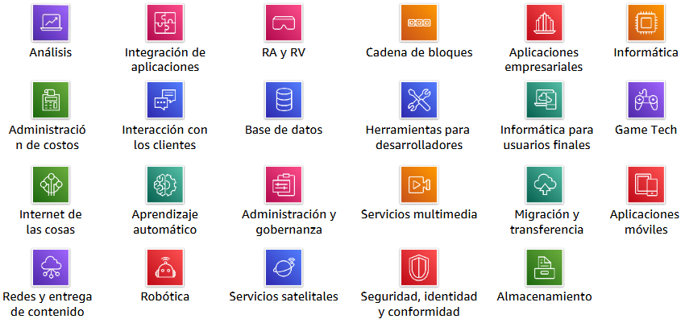
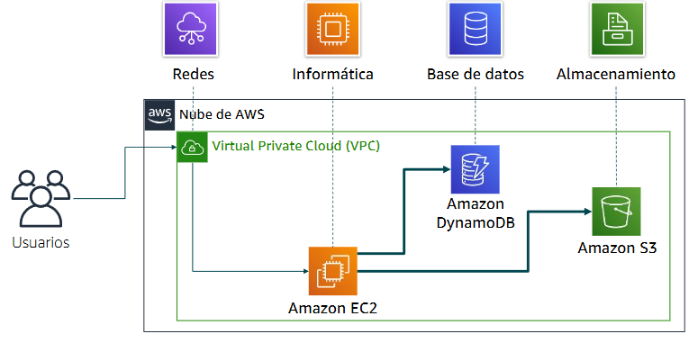
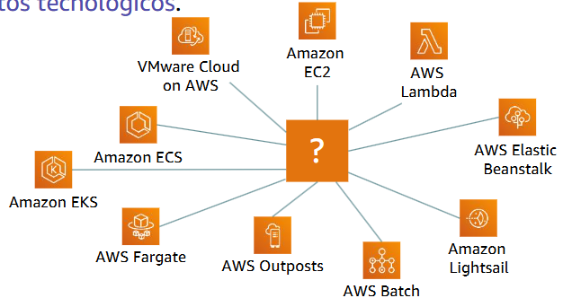
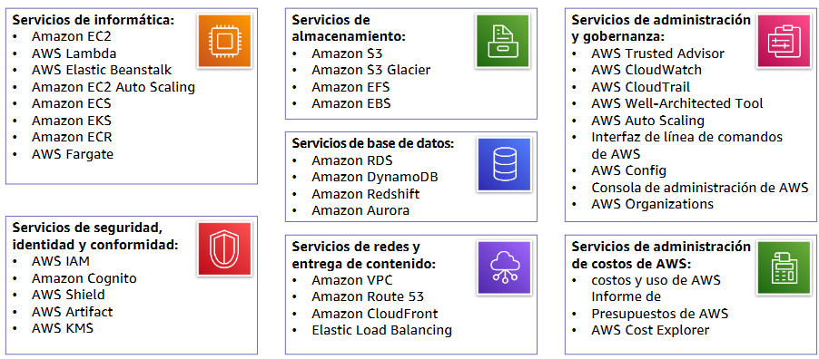
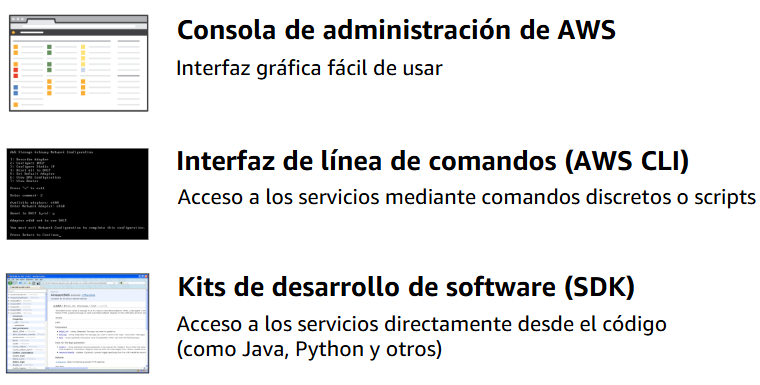

# Módulo 1 – Información general sobre los conceptos de la nube

Este módulo introduce los principios básicos de la informática en la nube, sus beneficios, su relación con AWS y el marco CAF para la adopción efectiva en organizaciones.

---

## 📌 Temas

- Introducción a la informática en la nube
- Ventajas de la informática en la nube
- Introducción a Amazon Web Services (AWS)
- Marco de adopción de la nube de AWS (CAF de AWS)

---

## Sección 1: **Introducción a la informática en la nube**
### ¿Qué es la informática en la nube?
Es una forma de usar servicios tecnológicos (como servidores, almacenamiento, bases de datos, redes, entre otros.) a través de internet, sin tener que comprarlos o instalarlos en tu computadora.

**¿Cómo funciona?**
- Tú usas una aplicación o servicio por internet (ejemplo: Google Drive, Netflix, Amazon).
- Esa app no está en tu compu, está en servidores remotos (la nube).
- Tú solo necesitas conexión a internet.

**Características principales:**
- **Acceso bajo demanda:** Puedes usar los servicios cuando los necesites, como prender la luz.
- **Acceso desde cualquier lugar:** Solo necesitas internet.
- **Escalabilidad:** Puedes aumentar o reducir el uso fácilmente.
- **Pago por uso:** Solo pagas lo que consumes (como el agua o la luz).
- **Multitenencia:** Muchas personas pueden usar el mismo servicio al mismo tiempo, de forma segura.

### ¿Qué es la infraestructura como software?
Es una práctica que permite administrar y aprovisionar la infraestructura tecnológica (como redes, servidores, base de datos) usando código, en lugar de hacerlo manualmente.

**¿Por qué es importante?**
- Automatiza tareas repetitivas y reduce errores humanos.
- Permite replicar entornos fácilmente (como desarrollo, pruebas y producción).
- Hace más rápido y eficiente el despliegue de servicios.

    **Ejemplo:** En vez de instalar un servidor uno por uno, escribes un archivo de configuración (por ejemplo, en YAML o JSON), lo ejecutas, y la infraestructura se crea automáticamente.

**Herramientas populares:**
- AWS CloudFormation
- Terraform
- Ansible

#### 🖥️ Modelo tradicional (en sitio o "on-premises")
Es cuando la empresa compra, instala y mantiene sus propios servidores, redes y sistemas en sus instalaciones físicas.

**Características:**
- La empresa es responsable de todo: hardware, software, seguridad, energía, mantenimiento.
- Requiere gran inversión inicial y personal técnico.
- Es menos flexible para crecer o adaptarse rápidamente.

### ☁️ Modelo en la nube (cloud computing)
La empresa alquila recursos tecnológicos (como servidores, almacenamiento, entre otros) a través de internet desde un proveedor como AWS.

**Características:**
- No necesitas comprar hardware, todo está en centros de datos del proveedor.
- Se paga solo por lo que se usa.
- Alta escalabilidad, disponibilidad y menor mantenimiento.

💡 **Comparación rápida:**
| **Característica**       | **Tradicional (On-premises)** | **Nube (Cloud)**             |
| -------------------- | ------------------------- | ------------------------ |
| **Inversión inicial**    | Alta                      | Baja                     |
| **Escalabilidad**        | Limitada                  | Alta                     |
| **Mantenimiento**        | Manual (propio)           | El proveedor lo gestiona |
| **Tiempo de despliegue** | Lento                     | Rápido                   |
| **Accesibilidad**        | Local                     | Desde cualquier lugar    |

### 📌 Modelos de entrega de servicios en la nube
Existen tres modelos principales que definen qué parte del servicio gestiona el proveedor y cuál gestiona el usuario:

☁️ IaaS (Infraestructura como servicio)
- Te da acceso a recursos básicos como servidores, redes y almacenamiento.
- Tú instalas el sistema operativo, las apps y gestionas la seguridad.
- Ejemplo: Amazon EC2, Azure VM, Google Compute Engine.

🧱 PaaS (Plataforma como servicio)
- Ofrece un entorno ya configurado para desarrollar y ejecutar aplicaciones.
- Solo te enfocas en el código, el proveedor se encarga del resto.
- Ejemplo: AWS Elastic Beanstalk, Google App Engine, Heroku.

🧑‍💻 SaaS (Software como servicio)
- Usas directamente la aplicación en internet, sin instalar ni mantener nada.
- El proveedor se encarga de todo.
- Ejemplo: Gmail, Microsoft 365, Dropbox.

**Comparación visual (basado en la imagen):**
| **Modelo** | **Nivel de control** | **¿Qué gestionas tú?**        | **¿Qué gestiona el proveedor?**       |
| ------ | ---------------- | ------------------------- | --------------------------------- |
| **IaaS**   | Alto             | SO, apps, configuraciones | Infraestructura física            |
| **PaaS**   | Medio            | Aplicación y datos        | Infraestructura, SO, plataforma   |
| **SaaS**   | Bajo             | Solo el uso de la app     | Todo (infraestructura y software) |

### 📌 Modelos de implementación de informática en la nube
Existen tres formas principales en las que una organización puede implementar la informática en la nube, dependiendo de sus necesidades de control, seguridad y flexibilidad:

**☁️ Nube pública**
- Toda la infraestructura (servidores, almacenamiento, redes) es propiedad del proveedor de servicios en la nube (como AWS, Google Cloud o Azure).
- El cliente accede a los recursos por internet.
- Es el modelo más común y económico.
- 🧩 Ejemplo: Hospedar una web o aplicación en AWS.

**🔁 Nube híbrida**
- Combina infraestructura local (servidores propios) con servicios en la nube.
- Permite mantener ciertos datos críticos en local y aprovechar la nube para escalar o procesar datos menos sensibles.
- 🧩 Ejemplo: Una empresa que guarda su base de datos en su servidor pero usa la nube para realizar copias de seguridad o análisis de datos.

**🏢 Infraestructura local / Nube privada**
- La infraestructura se encuentra dentro de la empresa, pero utiliza tecnologías similares a la nube (virtualización, automatización).
- Permite más control y personalización, pero con mayor responsabilidad y costos.
- 🧩 Ejemplo: Un banco que mantiene toda su infraestructura física por temas de seguridad.

**📊 Resumen visual (según la imagen):**
| **Modelo**             | **Dónde están los recursos**       | **¿Quién los gestiona?** | **Nivel de control** |
| ------------------ | ------------------------------ | -------------------- | ---------------- |
| **Nube pública**       | En la nube (proveedor externo) | El proveedor de nube | Bajo             |
| **Nube híbrida**       | En la nube y en la empresa     | Compartido           | Medio            |
| **Nube privada/local** | Dentro de la empresa           | La propia empresa    | Alto             |

### 📌 Similitudes entre AWS y la TI tradicional
Aunque la informática en la nube funciona de forma diferente a la tradicional, los conceptos básicos son los mismos. AWS ofrece versiones equivalentes para casi todos los componentes que se usaban en centros de datos físicos.

**🔐 Seguridad**
| **TI tradicional**          | **AWS**                          |
| ----------------------- | ---------------------------- |
| Firewalls               | Grupos de seguridad          |
| ACL (listas de control) | ACL de red                   |
| Administradores         | IAM (gestión de identidades) |

**🌐 Redes**
| **TI tradicional**        | **AWS**                    |
| --------------------- | ---------------------- |
| Enrutadores           | Amazon VPC             |
| Conmutadores y redes  | Elastic Load Balancing |
| Canalizaciones de red | Subredes en la VPC     |

**💻 Informática**
| **TI tradicional**      | **AWS**                        |
| ------------------- | -------------------------- |
| Servidores físicos  | Instancias EC2             |
| Imágenes de sistema | AMI (Amazon Machine Image) |

**💾 Almacenamiento y bases de datos**
| **TI tradicional**         | **AWS**                 |
| ---------------------- | ------------------- |
| DAS, SAN, NAS          | Amazon EBS, EFS, S3 |
| Bases de datos locales | Amazon RDS          |

---

## Sección 2: Ventajas de la informática en la nube
### 💰 Cambiar gastos de capital por gastos variables
En un entorno tradicional, las empresas deben realizar grandes inversiones iniciales en infraestructura (gastos de capital), como comprar servidores y montar centros de datos.

Con la nube, este modelo cambia:
- Solo pagas por lo que usas, como un servicio público (luz, agua).
- No es necesario prever la capacidad exacta, ya que puedes ajustar el uso según la demanda.

🧩 Ejemplo visual:
- Antes (Capital): Inviertes en servidores esperando la demanda futura.
- Ahora (Variable): Pagas solo por la capacidad real que consumes.

📌 Beneficios:
- Reduce los costos iniciales.
- Mejora la flexibilidad financiera.
- Permite comenzar con pocos recursos y escalar si es necesario.

### 📉 Economías de escala masivas
Gracias a que millones de usuarios utilizan los servicios de AWS, la empresa puede operar su infraestructura a gran escala. Esto le permite obtener costos más bajos por unidad de servicio (almacenamiento, procesamiento, red, entre otros).

**🧠 ¿Qué significa esto para ti?**
- AWS puede transferir esos ahorros a sus clientes.
- Mientras más usuarios usen la nube, más barata resulta para todos.

**🧩 Ejemplo visual:**
- AWS ofrece precios más bajos porque compra hardware y recursos en grandes volúmenes.
- El cliente final recibe una factura más baja por el uso de servicios.

**📌 Beneficios:**
- Reducción continua de precios.
- Acceso a tecnología de primer nivel a menor costo.
- No necesitas tener infraestructura propia para acceder a eficiencia operativa.

### 📈 Evitar asumir estimaciones sobre capacidad
En un entorno tradicional, las empresas deben adivinar cuánta capacidad necesitarán en el futuro. Esto puede llevar a dos problemas:
- Sobrestimar la capacidad: Se compran más servidores de los necesarios → se desperdician recursos y dinero.
- Subestimar la capacidad: No hay suficientes servidores → la aplicación se satura o falla.

Con la nube, este problema desaparece gracias al ajuste automático bajo demanda.

**🧠 ¿Cómo funciona?**
- AWS permite aumentar o reducir recursos automáticamente según la carga de trabajo.
- Ya no tienes que preocuparte por calcular cuántos servidores vas a necesitar dentro de seis meses.

**🧩 Ejemplo visual:**
- Si hay mucha demanda, se activan más instancias.
- Si la demanda baja, se desactivan para no generar costos innecesarios.

**📌 Beneficios:**
- Optimiza el uso de recursos.
- Evita pagar por capacidad no usada.
- Mejora el rendimiento sin interrupciones.

#### 🏢 Dejar de gastar en la ejecución y mantenimiento de centros de datos
Tradicionalmente, las empresas deben invertir en:
- Personal (nómina)
- Servicios básicos (electricidad, refrigeración, mantenimiento)
- Seguridad física, paisajería, y más
- Equipos costosos de hardware

Con la nube, todo esto lo asume el proveedor de servicios (como AWS). Ya no necesitas gestionar tu propio centro de datos.

**🧩 Ejemplo visual:**
- En lugar de gastar dinero en instalaciones físicas, puedes enfocar tus recursos en innovar y atender a tus clientes.

**📌 Beneficios:**
- Reducción significativa de costos operativos.
- Menos carga administrativa y técnica.
- Mayor enfoque en el crecimiento del negocio.

#### 🌍 Adquirir escala mundial en cuestión de minutos
Con la nube, puedes implementar tus servicios en centros de datos distribuidos por todo el mundo con solo unos clics. Esto te permite acercarte a tus usuarios, reducir la latencia y ofrecer mejor rendimiento.

**🧩 Ejemplo visual:**
- AWS tiene regiones en América, Europa, Asia y otros continentes.
- Puedes lanzar una aplicación en EE.UU., replicarla en Asia o Europa y mantener la sincronización fácilmente.

**📌 Beneficios:**
- Expansión internacional sin necesidad de presencia física.
- Mejora de la experiencia del usuario por cercanía geográfica.
- Alta disponibilidad global.
---

## Sección 3: Introducción a AWS
### 🌐 ¿Qué son los servicios web?
Un servicio web es cualquier software que se pone a disposición por medio de Internet y que permite la comunicación entre aplicaciones a través de un formato estandarizado, como:
- XML (Extensible Markup Language)
- JSON (JavaScript Object Notation)

Estas tecnologías permiten que una aplicación haga una solicitud a otra aplicación remota (por ejemplo, un servidor) y reciba una respuesta. Esto sucede mediante una interfaz de programación de aplicaciones o API (Application Programming Interface).

**🧩 Ejemplo visual:**
- Un cliente (como una laptop o app móvil) envía un mensaje de solicitud por internet.
- El servicio web recibe el mensaje, lo procesa y envía una respuesta.

**📌 Beneficios de los servicios web:**
- Permiten automatizar procesos.
- Facilitan la integración entre sistemas diferentes.
- Son la base para aplicaciones modernas como banca online, redes sociales, e-commerce, entre otros.

#### ☁️ ¿Qué es AWS?
Amazon Web Services (AWS) es una plataforma de servicios en la nube que ofrece una amplia gama de soluciones tecnológicas distribuidas globalmente.

**🧩 Características clave de AWS:**
- Es una plataforma segura y global, utilizada por millones de organizaciones.
- Proporciona acceso bajo demanda a recursos como servidores, almacenamiento, redes, bases de datos, análisis, inteligencia artificial, entre otros.
- **Permite una alta flexibilidad:** puedes elegir exactamente los servicios que necesitas.
- **Sigues un modelo de pago por uso:** solo pagas por lo que consumes.
- Sus servicios trabajan en conjunto como bloques de construcción que puedes combinar y escalar según tu proyecto.

#### 🧱 Categorías de los servicios de AWS
AWS ofrece más de 200 servicios organizados en categorías, según su propósito y funcionalidad. Estas categorías permiten a las empresas construir soluciones completas y personalizadas en la nube.

Algunas de las categorías más utilizadas incluyen:
- **Informática:** procesamiento de datos, servidores virtuales (por ejemplo, EC2).
- **Almacenamiento:** almacenamiento de archivos, copias de seguridad y recuperación (como Amazon S3).
- **Bases de datos:** servicios como Amazon RDS, DynamoDB, Aurora.
- **Redes y entrega de contenido:** conexión entre sistemas y distribución global de contenido (Amazon CloudFront, VPC).
- **Seguridad, identidad y conformidad:** gestión de usuarios y protección de datos (IAM, KMS).
- **Machine Learning:** modelos de aprendizaje automático (Amazon SageMaker).
- Desarrollo de aplicaciones móviles y multimedia.
- Internet de las cosas (IoT) y robótica, entre muchas otras.

    

#### 🧩 Ejemplo de una solución sencilla en AWS
Una solución básica en la nube de AWS puede combinar distintos servicios que trabajan juntos dentro de una VPC (Virtual Private Cloud). Por ejemplo:
- Amazon EC2 para ejecutar aplicaciones.
- Amazon DynamoDB como base de datos NoSQL.
- Amazon S3 para almacenar archivos como imágenes o backups.
- Todo esto operando dentro de una red privada segura.

    

#### 🔧 Elección de un servicio
La selección del servicio adecuado depende de tus objetivos y requisitos tecnológicos. AWS ofrece varias opciones para ejecutar aplicaciones, como:
- Amazon EC2 (máquinas virtuales)
- AWS Lambda (funciones sin servidor)
- Elastic Beanstalk, Fargate, ECS, EKS (contenedores)
- Lightsail, Batch, Outposts, entre otros.

    

#### 📦 Servicios que se tratan en este curso
Durante el curso se abordarán los principales servicios de AWS, agrupados por categorías:
- Informática, almacenamiento, bases de datos
- Seguridad y administración
- Redes y entrega de contenido
- Costos y monitoreo

    

#### 🖥️ Tres formas de interactuar con AWS
Puedes acceder a los servicios de AWS de tres maneras principales:
- Consola de administración: interfaz gráfica sencilla y visual.
- CLI (Command Line Interface): comandos para automatizar tareas.
- SDK (Software Development Kit): acceso desde lenguajes como Python, Java, Node.js, etc.

    

---

## Sección 4: Migración a la nube de AWS