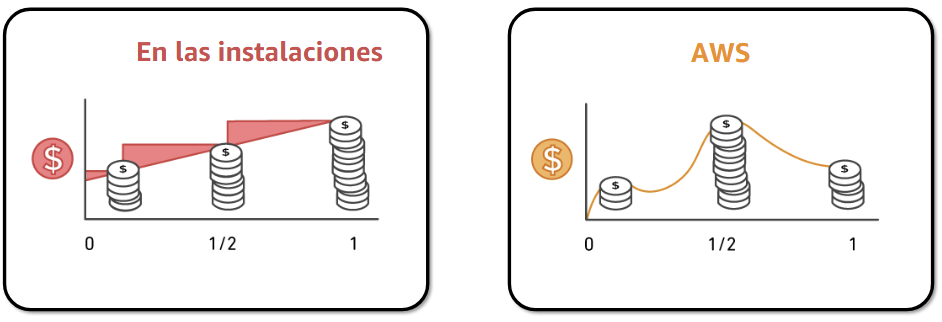
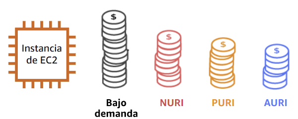
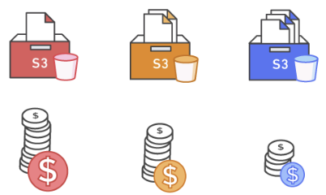
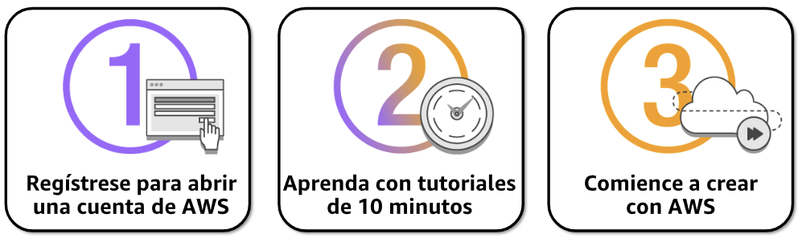
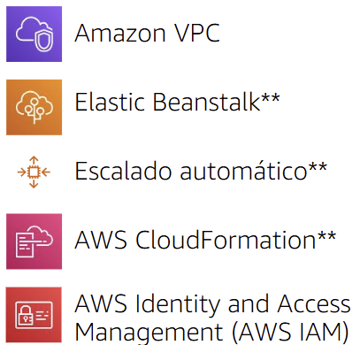
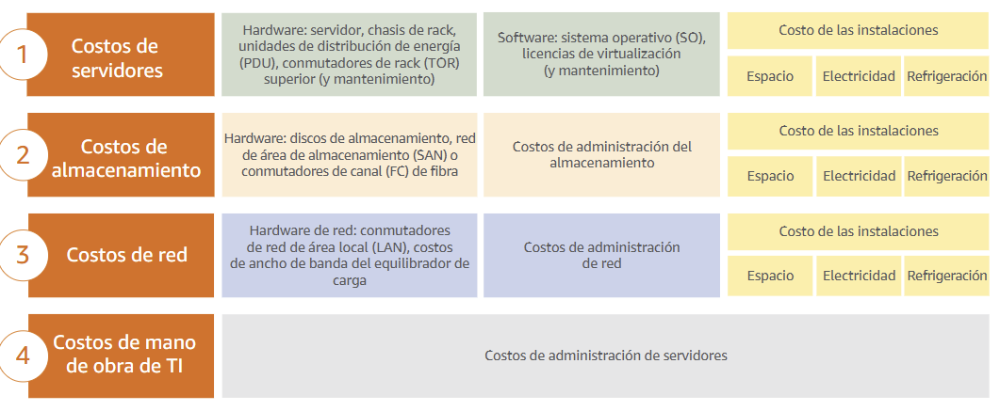

# Módulo 2 – Facturación y economía de la nube
Este módulo aborda cómo funciona el modelo de precios en AWS, cómo estimar costos, administrar el presupuesto y aprovechar herramientas que ayudan a optimizar los gastos en la nube. También se explica cómo AWS brinda soporte técnico y organizacional para una mejor gestión.

---

## 📌 Temas

- Aspectos fundamentales de los precios
- Costo total de propiedad
- AWS Organizations
- Administración de costos y facturación de AWS
- Soporte técnico

---

## Sección 1: **Aspectos fundamentales de los precios**
### 💸 Factores clave del modelo de precios
AWS organiza sus costos en tres factores principales:

**🖥️ 1. Cómputo**
- Se cobra por hora o por segundo, según el tipo de servicio e instancia (como EC2).
- El precio varía dependiendo del tipo de instancia, la región y el sistema operativo.
- La facturación por segundo aplica solo a instancias Linux.

**💾 2. Almacenamiento**
- Se cobra normalmente por gigabyte (GB) almacenado al mes.
- El costo depende del tipo de almacenamiento (por ejemplo, Amazon S3, EBS, Glacier).

**🌐 3. Transferencia de datos**
- La salida de datos (desde AWS hacia internet) tiene costo.
- La entrada de datos (hacia AWS) generalmente es gratuita, con algunas excepciones.
- El cobro se realiza usualmente por GB transferido.

### 🧾 ¿Cómo se paga en AWS?
AWS ofrece tres formas principales de ahorrar en sus servicios, dependiendo del uso y del compromiso del cliente:

**✅ 1. Paga por lo que usa**
- Solo pagas por los recursos que utilizas, sin necesidad de realizar grandes inversiones iniciales.
- Ideal para entornos dinámicos o pruebas.

    

**💰 2. Paga menos al reservar**
- Puedes obtener descuentos de hasta el 75% al reservar instancias (RI).
- Tipos de reservas:
  - AURI (All Upfront): mayor descuento
  - PURI (Partial Upfront): descuento medio
  - NURI (No Upfront): menor descuento

    

**📦 3. Paga menos por usar más**
- AWS ofrece descuentos por volumen: cuanto más utilizas, menos pagas por unidad (GB).
- Ejemplo: servicios como S3, EBS y EFS tienen precios por niveles.

    

**📉 4. Paga aún menos a medida que crece AWS**
- AWS transfiere sus ahorros de escala a los clientes.
- Desde 2006 ha bajado los precios más de 75 veces.
- Las mejoras de hardware se aplican sin costo adicional.

    

### 🧩 Precios personalizados**

AWS ofrece precios especiales para clientes con grandes volúmenes o necesidades específicas. Esto se negocia directamente con AWS.

### 🆓 Nivel gratuito de AWS**

Para nuevos usuarios, AWS ofrece un nivel gratuito por 12 meses, que incluye:

    

### 🆓 Servicios sin cargo en AWS**
AWS también ofrece ciertos servicios sin costo directo, lo que significa que no se cobra por usarlos como herramienta de gestión o automatización. Sin embargo, es importante tener en cuenta que sí pueden generar cargos indirectos si se combinan con otros servicios de AWS.

Ejemplos de servicios sin cargo:
- **Amazon VPC:** creación de redes privadas virtuales.
- **Elastic Beanstalk:** despliegue automático de aplicaciones.
- **Escalado automático:** ajuste dinámico de recursos según la demanda.
- **AWS CloudFormation:** infraestructura como código para automatizar despliegues.
- **AWS IAM:** control de identidades y permisos dentro de la cuenta.

    

---

## Sección 2: **Costo total de propiedad**
### En las instalaciones frente a la nube

**🏢 En las instalaciones (on-premises)**

Las organizaciones que operan su infraestructura local deben asumir:
- Compra y renovación de hardware físico
- Costos de instalación, energía, espacio y refrigeración
- Personal técnico para administración y soporte
- Mantenimiento, licencias, seguros y repuestos
- Tiempo de inactividad por fallos o actualizaciones

**☁️ En la nube con AWS**

Con AWS, los costos se transforman en gastos operativos variables, eliminando la necesidad de grandes inversiones iniciales.
- Pago por uso real
- Escalabilidad automática: se paga solo por lo que se necesita
- Menos costos de mantenimiento y soporte
- Actualizaciones automáticas
- Alta disponibilidad y recuperación sin infraestructura adicional

**🧮 Comparación general:**
| Concepto                 | En las instalaciones    | En la nube (AWS)         |
| ------------------------ | ----------------------- | ------------------------ |
| Compra de hardware       | Necesaria               | No aplica                |
| Escalabilidad            | Limitada (manual)       | Alta (automática)        |
| Costos de mantenimiento  | Altos y constantes      | Incluidos en el servicio |
| Personal técnico         | Interno y especializado | Se reduce                |
| Actualizaciones          | Manuales y periódicas   | Continuas y automáticas  |
| Tiempo de implementación | Semanas o meses         | Minutos o pocas horas    |

### ❓ ¿Qué es el TCO (Total Cost of Ownership)?
El Costo Total de Propiedad (TCO) es una estimación financiera que calcula todos los costos directos e indirectos relacionados con la adquisición, operación y mantenimiento de un sistema tecnológico a lo largo de su ciclo de vida.

No se trata solo del precio inicial, sino de todos los recursos necesarios para mantener ese sistema funcionando.

**📦 ¿Qué incluye el TCO?**
- **Costos de capital:** compra de servidores, redes, licencias y software.
- **Costos operativos:** energía, espacio físico, refrigeración, soporte técnico.
- **Mantenimiento y actualizaciones:** reparación de hardware, renovación de licencias.
- **Costos ocultos:** tiempos de inactividad, falta de escalabilidad, riesgos de seguridad.

**☁️ ¿Por qué es importante con AWS?**

AWS permite transformar estos gastos en costos variables y controlables, eliminando inversiones iniciales y simplificando la gestión de recursos.

### 🧾 Consideraciones sobre el Costo Total de Propiedad
El TCO incluye varios factores clave que a menudo se subestiman al evaluar el costo de tener infraestructura propia. Esta tabla resume los elementos más importantes:

    

### 🧮 Calculadora de precios de AWS
AWS ofrece una herramienta gratuita llamada AWS Pricing Calculator, que permite estimar con precisión los costos mensuales de los servicios que planeas utilizar.

**¿Para qué sirve?**
- Calcular los costos mensuales estimados de los servicios seleccionados.
- Identificar oportunidades de ahorro antes de implementar soluciones.
- Modelar arquitecturas sin necesidad de desplegar recursos reales.
- Evaluar diferentes tipos de instancias, regiones y contratos.
- Comparar opciones con diferentes métodos de pago (on-demand vs reservadas).
- Agrupar servicios y asignar presupuestos por proyecto o equipo.

### ➕ Consideraciones de beneficios adicionales
Más allá del ahorro en infraestructura, la nube ofrece ventajas operativas y estratégicas que impactan directamente en la eficiencia y competitividad de una empresa.

**💼 Beneficios duros (cuantificables)**
- Reducción de gastos en cómputo, almacenamiento, redes y seguridad.
- Menor inversión en hardware y software (CapEx).
- Disminución de costos operativos, respaldo y recuperación ante desastres.
- Reducción de personal necesario para tareas de operación.

**🌐 Beneficios blandos (intangibles)**
- Reutilización de servicios y aplicaciones, lo que mejora la innovación y flexibilidad.
- Mayor productividad de los equipos de desarrollo.
- Mejora en la satisfacción del cliente interno al tener soluciones más rápidas y eficaces.
- Procesos de negocio más ágiles y adaptables frente a oportunidades o riesgos nuevos.
- Mayor alcance global gracias a la escalabilidad de la nube.

### 📌 Caso práctico – Costo total de propiedad (Delaware North)
**Contexto:**
- Delaware North es una empresa global en expansión con más de 200 sedes.
- Atiende a 500 millones de clientes y genera 3000 millones USD de ingresos anuales.

**Desafío:**
- Necesitaban satisfacer la demanda para implementar nuevas soluciones de forma rápida.
- Tenían que actualizar constantemente los equipos obsoletos.

**Criterios para elegir una solución:**
- Contar con una solución integral capaz de gestionar múltiples cargas de trabajo.
- Posibilidad de modificar procesos para ganar eficiencia y reducir costos.
- Eliminar tareas pesadas como el parcheo de software.
- Obtener un ROI (retorno de inversión) positivo.

**Solución aplicada:**
- Migraron su centro de datos a AWS.
- Se eliminaron 205 servidores físicos (90 %).
- Se trasladaron casi todas las aplicaciones a la nube.
- Se usaron instancias reservadas de EC2 por 3 años.

**Comparación de costos (5 años):**
- Los costos operativos en AWS fueron significativamente más bajos en comparación con el entorno on-premises.
- Se observó un ahorro sostenido año tras año desde 2015 hasta 2019.

**Resultados obtenidos:**
- **Optimización de recursos:** mejor seguridad, capacidad informática y recuperación ante desastres.
- **Rapidez de comercialización:** aprovisionamiento en 1 día y despliegue de servicios en minutos.
- **Eficiencia operativa:** reducción continua de costos y mejor rendimiento.
---

## Sección 3: **AWS Organizations**

### 🧩 **¿Qué es AWS Organizations?**
- Servicio que permite administrar múltiples cuentas de AWS desde una organización centralizada.
- Permite aplicar políticas de acceso, administrar facturación y organizar cuentas según necesidades empresariales.

Beneficios principales:
- Políticas centralizadas de acceso.
- Acceso controlado a servicios.
- Creación automatizada de cuentas.
- Facturación unificada entre cuentas.

### 🌳 **Estructura y Terminología**
- Root: punto más alto de la jerarquía.
- OU (Organizational Unit): unidad organizativa que agrupa cuentas.
- Cuentas: pueden estar dentro de una OU.
- Se organiza como un árbol: root → OU → cuentas.

### ⚙️ **Funciones principales y beneficios**
- Políticas SCP (Service Control Policies): controlan acceso a servicios de AWS.
- Grupos de cuentas: permiten aplicar políticas a conjuntos de cuentas.
- APIs (Interfaces de programación): automatizan creación y administración.
- Facturación unificada: una sola factura para todas las cuentas.

### 🔒 **Seguridad con AWS Organizations**
- IAM no se reemplaza, sino que se complementa con SCPs.
- IAM aplica a usuarios, grupos y roles de una cuenta.
- SCPs se aplican a cuentas completas o grupos dentro de una OU.

### **🛠️ Configuración de AWS Organizations**

Pasos:
1. Crear una organización.
2. Crear unidades organizativas (OUs).
3. Crear políticas de control de servicios (SCP).
4. Aplicar restricciones y probar la configuración.

### **📊 Límites de AWS Organizations**
- Máximo de 1 root.
- 1000 OUs.
- 1000 políticas.
- Tamaño máximo por política: 5120 bytes.
- 5 niveles de anidamiento de OUs.
- 20 invitaciones por día.

### **🖥️ Acceso a AWS Organizations**
Se puede gestionar a través de:
- Consola de administración de AWS
- CLI de AWS
- SDKs (Kits de desarrollo de software)
- API HTTPS

---

## Sección 4: **Administración de costos y facturación de AWS**

### **📌 ¿Qué es?**
La Administración de facturación y costos de AWS permite pagar facturas, supervisar el uso y presupuestar los costos. Ayuda a prever gastos y entender patrones de consumo, lo cual es útil para planificar con anticipación.

**🎯 Funcionalidades principales:**
- Visualización por mes o por día.
- Agrupación y filtrado por múltiples dimensiones.
- Análisis de tendencias y oportunidades de optimización.

### **📊 Panel de facturación de AWS**
Muestra un resumen gráfico del uso y costos:
- Resumen de gastos: cuánto se gastó en el último mes y estimaciones.
- Gasto mensual por servicio: muestra qué servicios representan más costos.

### **🛠️ Herramientas de administración de costos**
**🔹 AWS Bills**
- Desglosa los cargos mensuales por servicio, región y cuenta.
- Permite ver la información más actualizada de costos y uso.

**🔹 Cost Explorer (Explorador de costos)**
- Permite visualizar costos a lo largo del tiempo.
- Funciones:
  - Ver gráficos de los últimos 13 meses.
  - Predecir gastos futuros.
  - Identificar servicios más usados o costosos.
  - Analizar tráfico y zonas de disponibilidad.

**🔹 AWS Budgets**
- Establece presupuestos y alertas por correo o SMS.
- Permite seguimiento mensual, trimestral o anual.

**🔹 Informes de costos y uso (Cost and Usage Reports - CUR)**
- Información detallada por tipo de servicio, operación, región, etc.
- Se actualiza hasta 1 vez por día y puede guardarse en un bucket de S3.

**✅ Beneficios clave:**
- Mayor visibilidad y control de gastos.
- Automatización del seguimiento financiero.
- Toma de decisiones informadas para optimización de costos.

---

## Sección 5: **Soporte técnico**
### **🧰 ¿Qué es AWS Support?**

Es un servicio que ofrece herramientas y experiencia técnica para apoyar a los usuarios en todo el ciclo de uso de AWS: desde pruebas, hasta producción y operación crítica.

Se brinda soporte para:
- Experimentación con servicios de AWS
- Uso en entornos de producción
- Operaciones críticas para empresas

Elementos clave:
- TAM (Technical Account Manager): asesores técnicos asignados para orientación proactiva, revisión de arquitectura y comunicación continua.
- Trusted Advisor: recomienda buenas prácticas para mejorar rendimiento, seguridad y optimizar costos.
- Support Concierge: equipo especializado en facturación y cuentas no técnicas.

### **📦 Planes de soporte**
AWS ofrece 4 planes de soporte:
| Plan           | Descripción breve                                                        |
| -------------- | ------------------------------------------------------------------------ |
| **Basic**      | Soporte limitado, acceso a documentación, foros, Trusted Advisor básico. |
| **Developer**  | Soporte para desarrollo inicial y entornos de prueba.                    |
| **Business**   | Soporte para producción; incluye acceso 24/7 y asesoría técnica.         |
| **Enterprise** | Soporte avanzado para cargas críticas. TAM incluido.                     |

### **⏱️ Severidad de los casos y tiempo de respuesta**
| Severidad   | Definición breve                                      | Plan Enterprise | Plan Business | Plan Developer |
| ----------- | ----------------------------------------------------- | --------------- | ------------- | -------------- |
| **Crítico** | Funciones críticas fuera de línea (negocio en riesgo) | 15 min o menos  | 1h o menos    | ❌              |
| **Urgente** | Afectación significativa al cliente                   | 1h o menos      | 1h o menos    | ❌              |
| **Alta**    | Funciones importantes degradadas                      | 4h o menos      | 4h o menos    | 12h o menos    |
| **Normal**  | Errores no críticos, comportamiento anormal           | 12h o menos     | 12h o menos   | 24h o menos    |
| **Baja**    | Consultas generales o mejoras solicitadas             | 24h o menos     | 24h o menos   | 24h o menos    |
