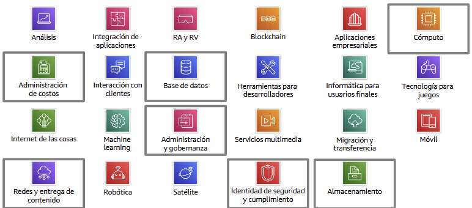

# Módulo 3 - Información general sobre la infraestructura global de AWS
Este módulo presenta cómo está distribuida la infraestructura global de AWS para garantizar alta disponibilidad, seguridad y baja latencia. Explica los componentes físicos como regiones, zonas de disponibilidad y puntos de presencia, y cómo influyen en la elección de servicios. Además, se introduce la clasificación de los servicios de AWS por categoría, ayudando a entender su función dentro de la nube.

---

## 📌 Temas

- Infraestructura global de AWS
- Servicios de AWS y sus categorías

---

## Sección 1: **Infraestructura global de AWS**

La infraestructura global de AWS fue diseñada para ofrecer un entorno de cómputo en la nube fiable, seguro y con alto rendimiento. Se actualiza constantemente para mostrar la huella física de AWS en todo el mundo y está compuesta por varios elementos clave:

**🌍 Regiones de AWS**
- Una región de AWS es una zona geográfica compuesta por dos o más zonas de disponibilidad.
- Usted puede elegir la región donde residirán sus datos y controlar la replicación entre regiones.
- Cada región tiene su propia red redundante y conectividad dedicada.
- La comunicación entre regiones utiliza la infraestructura de red troncal de AWS.
- AWS cuenta con más de 22 regiones globales (2022), y algunas están habilitadas o restringidas dependiendo del tipo de cuenta (por ejemplo, AWS GovCloud en EE.UU.).

**📍 Selección de una región**

Al seleccionar una región para desplegar servicios y almacenar datos, se deben considerar varios factores:
- Gobernanza de datos y requisitos legales: Las leyes locales pueden exigir que los datos se almacenen en ciertas regiones.
- Proximidad al cliente (latencia): Mientras más cerca esté la región del usuario, menor será la latencia.
- Servicios disponibles: No todos los servicios están disponibles en todas las regiones.
- Costos: El costo varía por región, incluso para el mismo tipo de instancia.

Herramientas como [CloudPing](https://www.cloudping.info/) ayudan a evaluar la latencia desde tu ubicación hacia las regiones de AWS.

**🟦 Zonas de disponibilidad (AZ)**

- Una zona de disponibilidad (AZ) es una partición físicamente separada dentro de la infraestructura de una región.
- Están compuestas por uno o varios centros de datos independientes.
- Están diseñadas para el aislamiento de errores y tienen suministro eléctrico, red y conectividad redundantes.
- Todas las zonas de una región están interconectadas por redes de alta velocidad.
- AWS recomienda replicar datos entre zonas de disponibilidad para garantizar resiliencia y alta disponibilidad.

**🏢 Centros de datos de AWS**
- Son el núcleo físico de la nube de AWS.
- Cada centro tiene alimentación, red y conectividad independientes, y se aloja en instalaciones seguras.
- Un solo centro puede albergar entre 50,000 y 80,000 servidores físicos.
- Están diseñados con múltiples capas de seguridad y tolerancia a errores.
- Las ubicaciones exactas no se divulgan por seguridad.
- Se realizan respaldos de los componentes del sistema crítico y mitigación del riesgo ambiental.

**🌐 Puntos de presencia (PoPs)**
- AWS proporciona una red global de puntos de presencia para mejorar la entrega de contenido.
- Se dividen en:
  - Ubicaciones perimetrales
  - Cachés de borde regionales
- Se utilizan para servicios como:
  - Amazon CloudFront (CDN): distribuye contenido con baja latencia.
  - Amazon Route 53: sistema DNS para direccionar tráfico a regiones óptimas.
  - AWS Shield / AWS WAF: seguridad de red.

**🛠️ Funciones clave de la infraestructura de AWS**

AWS ofrece tres beneficios clave en su infraestructura:
- Elasticidad y escalabilidad:
  - Los recursos pueden adaptarse dinámicamente a la demanda.
  - Se escalan automáticamente para crecer o reducirse según sea necesario.

- Tolerancia a errores:
  - Los componentes redundantes integrados permiten continuar operando incluso si hay fallos.

- Alta disponibilidad:
  - Permite reducir el tiempo de inactividad al mínimo.
  - Se logra sin intervención humana, manteniendo la continuidad operativa.

---

## Sección 2: **Servicios de AWS y sus categorías**

### **📦Servicios básicos de AWS**
- Se agrupan en: cómputo, almacenamiento, redes y bases de datos.
- Estos servicios forman la infraestructura principal bajo demanda.
- Se paga solo por lo que se usa (modelo bajo demanda).

### **📁 Categorías de servicios de AWS**

    

AWS tiene 23 categorías oficiales, aunque este curso se enfoca en las más relevantes para el examen:
- Cómputo
    
    👉 Proporciona capacidad de procesamiento.
    
    📌 Sirve para ejecutar aplicaciones, sitios web y tareas de backend mediante servidores virtuales, contenedores o funciones serverless.

- Almacenamiento
    
    👉 Guarda y protege datos en distintos formatos.
    
    📌 Incluye almacenamiento de objetos (S3), en bloques (EBS), en archivos (EFS) y a largo plazo (Glacier).

- Base de datos
    
    👉 Servicios administrados para distintos tipos de bases.
    
    📌 Permite usar bases relacionales (RDS, Aurora), NoSQL (DynamoDB) y analíticas (Redshift) sin preocuparse por mantenimiento.

- Redes y entrega de contenido
    
    👉 Conecta recursos y acelera la entrega de datos.
    
    📌 Ofrece redes privadas virtuales (VPC), balanceadores de carga, servicios DNS (Route 53) y distribución de contenido (CloudFront).

- Seguridad, identidad y cumplimiento

    👉 Protege los recursos y controla el acceso.
    
    📌 Incluye control de usuarios (IAM), cifrado (KMS), protección contra DDoS (Shield) y cumplimiento normativo (Artifact).

- Administración de costos

    👉 Analiza, optimiza y controla gastos.
    
    📌 Proporciona reportes de uso, planificación presupuestaria (Budgets) y análisis visual de costos (Cost Explorer).

- Administración y gobernanza
    
    👉 Administra, supervisa y audita recursos.
    
    📌 Permite controlar configuraciones (Config), hacer seguimiento (CloudTrail), automatizar tareas (CLI) y evaluar buenas prácticas (Trusted Advisor, Well-Architected).

**🟩 Categoría de servicios de almacenamiento**

**📘 ¿Qué es?**

Servicios que permiten guardar, proteger y acceder a datos de forma escalable, segura y bajo demanda.

🛠️ Servicios clave:
- Amazon S3 (Simple Storage Service): Almacenamiento de objetos ideal para datos no estructurados como archivos, imágenes o copias de seguridad.
- Amazon EBS (Elastic Block Store): Almacenamiento en bloques para volúmenes de disco usados por EC2.
- Amazon EFS (Elastic File System): Sistema de archivos escalable y compartido para múltiples instancias.
- Amazon Glacier: Almacenamiento a largo plazo y de bajo costo para archivos que no se acceden con frecuencia.

**🟧 Categoría de servicios de cómputo**

**📘 ¿Qué es?**

Servicios que proporcionan capacidad de procesamiento flexible, según demanda.

🛠️ Servicios clave:
- Amazon EC2: Instancias de máquina virtual para ejecutar aplicaciones.
- Amazon EC2 Auto Scaling: Ajuste automático de la cantidad de instancias EC2.
- Amazon ECS: Coordinación de contenedores Docker.
- Amazon EKS: Orquestación de contenedores con Kubernetes.
- AWS Fargate: Ejecuta contenedores sin gestionar servidores.
- AWS Lambda: Ejecuta código sin aprovisionar servidores, solo paga por uso.
- Elastic Beanstalk: Despliegue automático de aplicaciones web.

**🟦 Categoría de servicios de base de datos**

**📘 ¿Qué es?**

Sistemas administrados para almacenar, consultar y analizar datos, ya sean relacionales o no relacionales.

🛠️ Servicios clave:
- Amazon RDS: Bases de datos relacionales como MySQL, PostgreSQL, SQL Server.
- Amazon Aurora: Motor de base de datos relacional compatible con MySQL y PostgreSQL, pero más rápido.
- Amazon Redshift: Almacenamiento de datos para análisis a gran escala (Big Data).
- Amazon DynamoDB: Base de datos NoSQL tipo documento o clave-valor.

**🟪 Categoría de servicios de redes y entrega de contenido**

**📘 ¿Qué es?**

Servicios para construir redes privadas virtuales, equilibrar tráfico y distribuir contenido globalmente.

🛠️ Servicios clave:
- Amazon VPC (Virtual Private Cloud): Red privada virtual segura dentro de AWS.
- Elastic Load Balancing: Balanceo de carga para distribuir tráfico automáticamente.
- Amazon CloudFront: Red de distribución de contenido (CDN).
- AWS Transit Gateway: Conexión de múltiples VPC y redes locales.
- Amazon Route 53: Servicio DNS para enrutar tráfico.
- AWS Direct Connect: Conexión dedicada desde tu centro de datos.
- AWS VPN: Conexión cifrada entre tu red y AWS.

**🟥 Categoría de servicios de seguridad, identidad y cumplimiento**

**📘 ¿Qué es?**

Servicios que garantizan el control de acceso, cumplimiento normativo y protección de datos.

🛠️ Servicios clave:
- AWS IAM (Identity and Access Management): Gestión de permisos y accesos por usuarios, grupos y roles.
- AWS Organizations: Gestión centralizada de múltiples cuentas AWS.
- Amazon Cognito: Autenticación de usuarios en apps móviles y web.
- AWS Artifact: Acceso a informes de cumplimiento y seguridad.
- AWS KMS (Key Management Service): Creación y gestión de claves de cifrado.
- AWS Shield: Protección ante ataques DDoS.

**🟨 Categoría de servicios de administración de costos**

**📘 ¿Qué es?**

Herramientas que permiten estimar, planificar y optimizar los gastos de AWS.

🛠️ Servicios clave:
- Informe de uso y costo de AWS: Reportes detallados de consumo por hora o por día.
- AWS Budgets: Definición de presupuestos con alertas personalizadas.
- Explorador de costos de AWS: Visualiza tendencias de costos y uso.

**🟫 Categoría de servicios de administración y gobernanza**

**📘 ¿Qué es?**

Soluciones para monitorear, automatizar y controlar la gestión de recursos y configuraciones en la nube.

🛠️ Servicios clave:
- Consola de administración de AWS: Interfaz web para gestionar tu cuenta y recursos.
- AWS Config: Seguimiento de cambios y configuración de recursos.
- Amazon CloudWatch: Monitoreo de rendimiento de aplicaciones y recursos.
- AWS Auto Scaling: Escala automática de recursos para satisfacer demanda.
- AWS CLI: Herramienta de línea de comandos para interactuar con servicios.
- AWS Trusted Advisor: Recomendaciones para optimizar seguridad y costos.
- AWS Well-Architected Tool: Evaluación de buenas prácticas en arquitectura.
- AWS CloudTrail: Registro de actividades de usuarios y API.