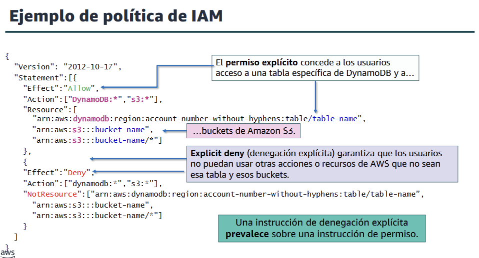
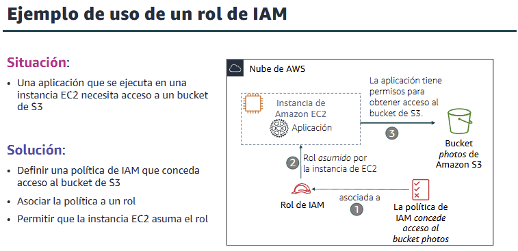

# Módulo 4 - Seguridad en la nube
Texto

---

## 📌 Temas

- Modelo de responsabilidad compartida de AWS
- AWS IAM
- Protección de una cuenta nueva de AWS
- Protección de cuentas
- Protección de datos AWS
- Cómo garantizar la conformidad

---

## Sección 1: **Modelo de responsabilidad compartida de AWS**

**🔒 ¿Qué es?**

Es un modelo que define quién es responsable de qué en términos de seguridad y cumplimiento dentro de AWS:
- AWS se encarga de la seguridad de la nube.
- El cliente se encarga de la seguridad en la nube.

### **🟠 Responsabilidad de AWS (seguridad de la nube)**
AWS administra la infraestructura física que ejecuta todos los servicios:
- Seguridad de los centros de datos físicos.
- Infraestructura de hardware, software, red y virtualización.
- Ejemplo: mantenimiento de servidores, protección física, red troncal global, virtualización del hipervisor, etc.

### **🔵 Responsabilidad del cliente (seguridad en la nube)**
El cliente es responsable de:
- Datos del cliente (cifrado, acceso).
- Aplicaciones que implementa.
- Configuración de red y firewall, contraseñas, actualizaciones.
- Control de acceso (usuarios, roles, permisos con IAM).

⚠️ Los clientes controlan todo lo que suben, configuran y manejan en AWS.

### **🧱 Tipos de servicios y su implicación**
1. IaaS (Infraestructura como Servicio)
   
   El cliente gestiona más (ej. EC2, VPC, EBS).

2. PaaS (Plataforma como Servicio)
   
   AWS gestiona más, el cliente se enfoca en aplicaciones (ej. Lambda, RDS).
3. SaaS (Software como Servicio)
   
   AWS gestiona casi todo (ej. Amazon Chime, Trusted Advisor).

### **🎯 Ejemplo práctico (escenario 1 y 2)**
Se muestran casos donde el cliente debe decidir si AWS o él mismo es responsable de:
- Configurar claves, reglas de firewall, acceso SSH, cifrado, backups.
- El cliente siempre es responsable de lo que construye o configura.

    
    

---

## Sección 2: **AWS IAM**
### **✅ ¿Qué es AWS IAM?**
AWS IAM permite controlar quién puede acceder a qué recursos en la nube de AWS. Es una herramienta que ayuda a gestionar la autenticación (identidad) y la autorización (permisos) de forma segura y centralizada.

🔸 Principales usos de IAM:
- Controla acceso a servicios como EC2, S3, RDS, etc.
- Define quién puede acceder, a qué recurso y con qué permisos.
- Gratuito y disponible con cualquier cuenta de AWS.

### **🧱 Componentes clave de IAM**
- **Usuario IAM:** Persona o aplicación con credenciales (nombre + contraseña o claves).
- **Grupo IAM:** Conjunto de usuarios con los mismos permisos.
- **Política IAM:** Documento (en JSON) que define los permisos (lo que un usuario/grupo/rol puede hacer).
- **Rol IAM:** Permite asignar permisos temporales a servicios o usuarios (por ejemplo, para EC2).

### **🔐 Acceso a recursos**
- Acceso mediante programación: uso de CLI, SDK, claves de acceso.
- Acceso mediante consola: uso de navegador con nombre de usuario, contraseña y MFA.

### **🔒 MFA (Autenticación multifactor)**
- Añade una capa extra de seguridad.
- Combina usuario + contraseña + código único generado por una app o dispositivo físico.

### **✅ Autorización: ¿qué se puede hacer?**
- Las políticas IAM determinan qué acciones están permitidas sobre los recursos.
- Por defecto: acceso denegado a todo (principio de denegación implícita).
- Recomendación: aplicar el principio de mínimo privilegio (dar solo los permisos necesarios).

### **📄 Tipos de políticas:**
- Basadas en identidad: se asignan a un usuario, grupo o rol.
- Basadas en recursos: se adjuntan directamente a recursos (como un bucket de S3).

### **🧪 Ejemplo de política:**
Una política en formato JSON puede:
- Permitir acceso a una tabla de DynamoDB.
- Denegar acceso a buckets no autorizados.
- Incluir permisos explícitos o denegaciones explícitas.

    

### **🧪 Evaluación de permisos**
IAM verifica primero si hay una denegación explícita → luego si existe un permiso explícito → si no, se aplica denegación implícita.

### **👥 Grupos de IAM**
- Facilitan la administración de permisos a varios usuarios a la vez.
- Un usuario puede pertenecer a varios grupos, pero no se añaden automáticamente.

### **🎭 Roles de IAM**
- Se usan para delegar permisos temporales a recursos o servicios.
- Ejemplo: una instancia EC2 asume un rol para acceder a un bucket de S3 sin credenciales permanentes.

### **🧪 Ejemplo de uso de un rol de IAM**

    

**Escenario:** Una aplicación que se ejecuta en una instancia EC2 necesita acceder a un bucket de Amazon S3 llamado photos.

Solución paso a paso:
- 🔐 Crear una política de IAM
Define explícitamente el permiso para acceder al bucket photos.
- 🧩 Asociar la política a un rol de IAM
El rol contiene los permisos que serán asumidos por el recurso (EC2 en este caso).
- 🚀 Permitir que la instancia EC2 asuma el rol
La instancia toma temporalmente los permisos definidos para acceder directamente al bucket de S3, sin necesidad de almacenar credenciales en la aplicación.

Beneficio clave:
- Permite el acceso seguro a recursos sin gestionar manualmente claves de acceso, siguiendo el principio de mínimo privilegio y usando permisos temporales.

---

## Sección 3: **Protección de una cuenta nueva de AWS**
Cuando se crea una cuenta nueva de AWS, es importante protegerla inmediatamente para evitar riesgos de seguridad. AWS recomienda seguir cuatro pasos claves:

**✅ Paso 1:** Dejar de usar el usuario raíz
Recomendación: No usar el usuario raíz salvo que sea estrictamente necesario.

Acciones a seguir:
1. Iniciar sesión con el usuario raíz para crear un usuario IAM con privilegios de administrador
2. Crear grupo de IAM con políticas adecuadas.
3. Asignar usuario IAM al grupo.
4. Deshabilitar claves de acceso del usuario raíz si existen.
5. Habilitar MFA (ver paso 2).
6. Guardar credenciales del usuario raíz en lugar seguro.

2. **✅ Paso 2: Habilitar MFA (Autenticación multifactor)**
- Importancia: Añade una capa de seguridad adicional al requerir un código temporal además del usuario y contraseña.
- Opciones de MFA:
  - Aplicaciones virtuales (Google Authenticator, Authy).
  - Dispositivos físicos U2F.
  - Tarjetas de visualización o llaveros con MFA.

3. **✅ Paso 3: Usar AWS CloudTrail**
- Descripción: Servicio que registra todas las acciones en la cuenta (llamadas a la API).
- Ventajas:
  - Auditar acciones.
  - Rastrear errores o accesos no autorizados.
  - Descarga de logs de los últimos 90 días.
- Recomendación: Crear un bucket S3 para almacenar los registros de CloudTrail.

4. **✅ Paso 4: Habilitar informe de facturación**
- Uso del informe de uso y costo de AWS:
  - Da seguimiento a los recursos usados y sus costos.
  - Se almacena en un bucket S3.
  - Se actualiza al menos una vez por día.

---

## Sección 4: **Protección de cuentas**
### **🧩 AWS Organizations**
- Permite consolidar varias cuentas de AWS bajo una administración central.
- Se pueden agrupar cuentas en Unidades Organizativas (OUs) y aplicar políticas específicas.
- Se integra con IAM, combinando políticas organizativas con permisos por usuario.
- Facilita la gestión de permisos, seguridad, y cumplimiento en entornos grandes.

### **⚙️ Política de control de servicios (SCPs)**
- Las SCPs definen los permisos máximos que se pueden conceder dentro de una organización.
- No otorgan acceso por sí solas, solo limitan el acceso posible.
- Se aplican a todas las cuentas y OUs dentro de la organización.
- Tienen sintaxis similar a las políticas IAM, pero son independientes de los permisos concedidos por IAM.

### **🔐 AWS Key Management Service (AWS KMS)**
- Permite crear y controlar claves de cifrado para proteger datos en AWS.
- Se integra con CloudTrail para registrar el uso de claves.
- Usa módulos HSM (Hardware Security Module) validados bajo estándares como FIPS 140-2.
- Claves maestras de cliente (CMK) son gestionadas por el usuario o por AWS.

### **👤 Amazon Cognito**
- Administra usuarios, inicio de sesión y control de acceso en aplicaciones web o móviles.
- Se integra con proveedores como Facebook, Google, Amazon, Microsoft AD (SAML 2.0).
- Escala hasta millones de usuarios.
- Facilita el cumplimiento de normativas de seguridad y privacidad, como HIPAA, ISO, etc.

### **🛡️ AWS Shield*
- Protege contra ataques de denegación de servicio (DDoS).
- AWS Shield Standard se activa automáticamente y protege sin costo adicional.
- AWS Shield Advanced es un servicio de pago con protección avanzada para apps críticas.
- Reduce el tiempo de inactividad y mejora la disponibilidad mediante mitigación directa.

---

## Sección 5: **Protección de datos AWS**
### **🔐 Cifrado de datos en reposo**
- El cifrado convierte datos legibles en ilegibles usando una clave secreta.
- Solo quien tenga la clave puede descifrarlos.
- AWS KMS permite gestionar estas claves.
- Se aplica a servicios como Amazon S3, EBS, EFS y RDS.
- Datos en reposo: datos almacenados físicamente (en disco o cinta).
- Aumenta la confidencialidad y protege el acceso físico no autorizado.

### **🌐 Cifrado de datos en tránsito**
- Protege datos que viajan por redes.
- Usa TLS (Transport Layer Security) o SSL.
- AWS Certificate Manager ayuda a administrar certificados TLS/SSL.
- HTTPS (TLS sobre HTTP) crea un canal seguro bidireccional.
- Se aplica en EC2, S3, EFS, Storage Gateway, etc.

### **🪣 Protección de buckets y objetos de Amazon S3**
- Los buckets de S3 son privados por defecto.
- Para compartir objetos de forma segura:
- Bloquear el acceso público (Block Public Access)
- Usar políticas de IAM por usuario o grupo
- Aplicar políticas de bucket específicas.
- Utilizar listas de control de acceso (ACLs) para control granular.
- AWS Trusted Advisor recomienda ajustes de seguridad en S3.

---

## Sección 6: **Cómo garantizar la conformidad**
### **🧩 Programas de conformidad de AWS**
- AWS colabora con organismos de certificación y auditoría independientes.
- Informa a los clientes sobre las políticas, procesos y controles de seguridad y cumplimiento que implementa.
- Categorías clave:
  - Certificaciones: ISO 27001, 27017, 27018, ISO/IEC 9001.
  - Leyes, regulaciones y privacidad: RGPD, HIPAA, Ley de Privacidad del Consumidor de California (CCPA).
  - Alineamientos y marcos de trabajo: NIST, CIS, PCI DSS.

- AWS proporciona [una lista de programas de conformidad](https://aws.amazon.com/es/compliance/programs/) y detalla qué servicios están cubiertos en el [ámbito de conformidad de AWS](https://aws.amazon.com/es/compliance/services-in-scope/).

### **⚙️ AWS Config**
- Permite auditar, analizar y monitorear continuamente las configuraciones de los recursos en AWS.
- Detecta desviaciones entre configuraciones deseadas y actuales.
- Funciones principales:
  - Revisión de historial de cambios.
  - Evaluación de cumplimiento de políticas.
  - Automatización de alertas.
- Soporte para auditorías internas o externas.
- Es un servicio regional pero puede mostrar una vista agregada de múltiples regiones o cuentas.

### **📄 AWS Artifact**
- Es un repositorio de documentos de seguridad y cumplimiento.
- Acceso bajo demanda a:
  - Certificaciones ISO.
  - Informes de cumplimiento (como PCI DSS, SOC 1 y 2).
  - Acuerdos legales (como BAA – Business Associate Agreement para HIPAA).

- Se accede directamente desde la consola de AWS.
- Ideal para demostrar cumplimiento ante auditores y clientes.
- Las organizaciones pueden usarlo para gestionar acuerdos legales centralizados.