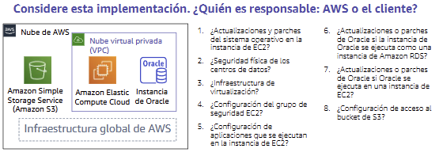
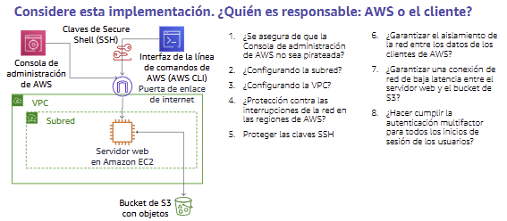

# Módulo 4 - Seguridad en la nube
Texto

---

## 📌 Temas

- Modelo de responsabilidad compartida de AWS
- AWS IAM
- Protección de una cuenta nueva de AWS
- Protección de cuentas
- Protección de datos AWS
- Cómo garantizar la conformidad

---

## Sección 1: **Modelo de responsabilidad compartida de AWS**

**🔒 ¿Qué es?**

Es un modelo que define quién es responsable de qué en términos de seguridad y cumplimiento dentro de AWS:
- AWS se encarga de la seguridad de la nube.
- El cliente se encarga de la seguridad en la nube.

### **🟠 Responsabilidad de AWS (seguridad de la nube)**
AWS administra la infraestructura física que ejecuta todos los servicios:
- Seguridad de los centros de datos físicos.
- Infraestructura de hardware, software, red y virtualización.
- Ejemplo: mantenimiento de servidores, protección física, red troncal global, virtualización del hipervisor, etc.

### **🔵 Responsabilidad del cliente (seguridad en la nube)**
El cliente es responsable de:
- Datos del cliente (cifrado, acceso).
- Aplicaciones que implementa.
- Configuración de red y firewall, contraseñas, actualizaciones.
- Control de acceso (usuarios, roles, permisos con IAM).

⚠️ Los clientes controlan todo lo que suben, configuran y manejan en AWS.

### **🧱 Tipos de servicios y su implicación**
1. IaaS (Infraestructura como Servicio)
   
   El cliente gestiona más (ej. EC2, VPC, EBS).

2. PaaS (Plataforma como Servicio)
   
   AWS gestiona más, el cliente se enfoca en aplicaciones (ej. Lambda, RDS).
3. SaaS (Software como Servicio)
   
   AWS gestiona casi todo (ej. Amazon Chime, Trusted Advisor).

### **🎯 Ejemplo práctico (escenario 1 y 2)**
Se muestran casos donde el cliente debe decidir si AWS o él mismo es responsable de:
- Configurar claves, reglas de firewall, acceso SSH, cifrado, backups.
- El cliente siempre es responsable de lo que construye o configura.

    
    

---

## Sección 2: **AWS IAM**

---

## Sección 3: **Protección de una cuenta nueva de AWS**

---

## Sección 4: **Protección de cuentas**

---

## Sección 5: **Protección de datos AWS**

---

## Sección 6: **Cómo garantizar la conformidad**