# Módulo 5 - Redes y entrega de contenido
Texto

---

## 📌 Temas

- Conceptos básicos de las redes
- Amzon VPC
- Redes de VPC
- Seguridad de VPC
- Route S3
- CloudFront

---

## Sección 1: **Conceptos básicos de las redes**
### **🔌 ¿Qué es una red?**
Una red informática conecta dos o más máquinas (clientes) para compartir recursos.
- Las redes pueden dividirse lógicamente en subredes.
- Requieren dispositivos de red como enrutadores o switches para permitir la comunicación entre clientes.

### **🌐 Dirección IP**
Cada dispositivo en una red tiene una dirección IP única (formato decimal).
- Se compone de 4 números separados por puntos (IPv4).
- Cada número puede ir de 0 a 255 (representa 8 bits → 1 byte).
- Ejemplo: 192.0.2.0 equivale en binario a:
  - 11000000 . 00000000 . 00000010 . 00000000

### **📏 IPv4 vs IPv6**
- IPv4: 32 bits → formato clásico, limitado en cantidad.
- IPv6: 128 bits → diseñado para una mayor cantidad de dispositivos.
  - Ejemplo IPv6: 2600:1f18:22ba:8c00:ba86:a05e:a5ba:00F
  - Compuesto por 8 grupos de 4 caracteres hexadecimales (16 bits cada uno).
  - Soporta ≈ 340 undecillones de direcciones únicas.

### **📶 CIDR – Enrutamiento sin clases**
CIDR (Classless Inter-Domain Routing) permite definir la porción de red y de host en una dirección IP:
- Sintaxis: Dirección IP / número de bits de red
- Ejemplo: 192.0.2.0/24 → los primeros 24 bits son de red, los otros 8 bits son para hosts.
  - Permite 2⁸ = 256 direcciones.
- Si fuese 192.0.2.0/16, se podrían usar 2¹⁶ = 65,536 direcciones (más flexibilidad).

### **🧱 Modelo OSI (Interconexión de Sistemas Abiertos)**
Modelo conceptual con 7 capas que explica cómo viajan los datos en la red:

| Capa         | Nº | Función Principal                     | Protocolos / Direcciones |
| ------------ | -- | ------------------------------------- | ------------------------ |
| Aplicación   | 7  | Acceso a aplicaciones de red          | HTTP/S, FTP, DHCP        |
| Presentación | 6  | Formato y cifrado de datos            | ASCII, ICA               |
| Sesión       | 5  | Manejo de sesiones entre aplicaciones | NetBIOS, RPC             |
| Transporte   | 4  | Entrega confiable entre host          | TCP, UDP                 |
| Red          | 3  | Enrutamiento y direcciones IP         | IP                       |
| Enlace       | 2  | Transferencia en redes LAN            | MAC                      |
| Física       | 1  | Transmisión de bits físicos           | Señales, cables          |

- Enrutadores operan en capa 3 (Red).
- Switches y hubs operan en capa 2 (Enlace de datos)
- AWS también usa este modelo para crear redes virtuales (como las VPC).

---

## Sección 2: **Amzon VPC**
### **🌐 ¿Qué es Amazon VPC?**
Amazon VPC (Virtual Private Cloud) te permite aprovisionar una red privada virtual en la nube de AWS.
- Es una sección aislada lógicamente, donde puedes lanzar recursos como EC2.
- Puedes definir rango IP, subredes, reglas de seguridad, tablas de enrutamiento.

### **🧱 Componentes clave de una VPC**
- Direcciones IP privadas: cada VPC necesita un bloque de direcciones IPv4 (CIDR).
- Subredes: divisiones lógicas dentro de la VPC, pueden ser:
  - Públicas: con acceso a Internet.
  - Privadas: sin acceso a Internet.
- Seguridad: mediante grupos de seguridad (SG) y listas de control de acceso (ACL).
- Tablas de enrutamiento: definen hacia dónde va el tráfico.

### **📍 Dirección IP y Subredes**
- Un bloque CIDR define el rango IP de tu VPC. Ejemplo: 10.0.0.0/16 → 65,536 IPs.
- Subredes más pequeñas como 10.0.0.0/24 → 256 IPs, de las cuales:
  - Solo 251 IPs están disponibles (5 reservadas por AWS).

### **🚦 Tipos de IP públicas**
- IPv4 pública:
  - Se asigna manualmente o de forma automática.
- IP elástica (EIP):
- Se asocia a tu cuenta de AWS.
- Puede reasignarse.
- Tiene costos adicionales si no se utiliza.

### **🔌 Interfaz de red elástica (ENI)**
- Es una tarjeta de red virtual que puedes conectar/desconectar de una instancia.
- Cada ENI tiene:
  - Una IP principal.
  - Una dirección MAC.
  - Se puede mover entre instancias.

### **🛣️ Tablas de enrutamiento**
- Son conjuntos de reglas (rutas) que indican hacia dónde debe ir el tráfico.
- Cada subred debe estar asociada a una tabla de rutas.
- Hay una tabla predeterminada para cada VPC con una ruta local (10.0.0.0/16 → local).

---

## Sección 3: **Redes de VPC**
### **🌐 Puerta de enlace de internet (IGW)**
- Permite que las instancias con IP pública se comuniquen con Internet.
- Se debe:
  - Adjuntar una IGW a la VPC.
  - Agregar una ruta 0.0.0.0/0 en la tabla de enrutamiento de la subred pública.

    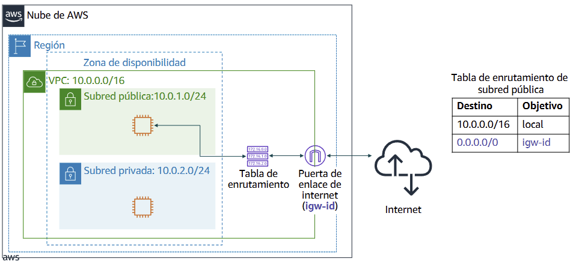

### **🔄 Puerta NAT (Network Address Translation)**
- Permite que las instancias en subred privada accedan a Internet (para actualizaciones, etc.) sin ser accesibles desde Internet.
- Se necesita:
  - Una subred pública con una NAT Gateway o NAT Instance.
  - Ruta desde la subred privada hacia la NAT.

    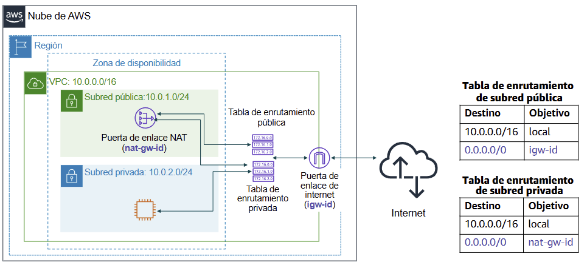

### **🔄 Uso compartido de VPC**
- Permite que subredes sean compartidas con otras cuentas dentro de la misma organización (AWS Organizations).
- Beneficios:
  - Separación de funciones y recursos.
  - Grupos de seguridad pueden referenciarse entre cuentas.
  - Ahorro de costos y administración centralizada.

    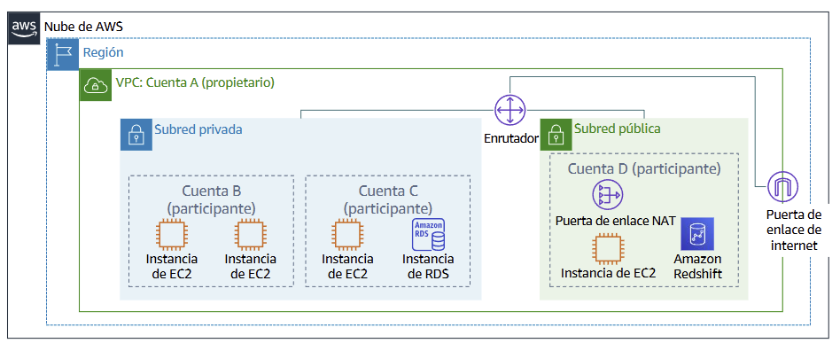

### **🔗 Interconexión de VPC (VPC Peering)**
- Permite la comunicación directa entre dos VPC.
- Reglas:
  - Las IPs no deben superponerse.
  - La interconexión no es transitiva (no se propaga entre VPCs).
  - Se debe actualizar la tabla de rutas en ambas VPC.

    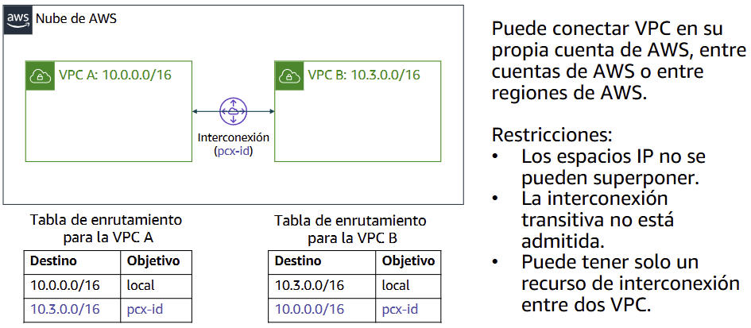

### **🔐 AWS Site-to-Site VPN**
- Conecta la VPC con tu red corporativa a través de Internet de forma segura.
- Pasos básicos:
  - Crear una conexión VPN.
  - Asociarla a una puerta de enlace virtual.
  - Configurar el enrutamiento y reglas de seguridad.

    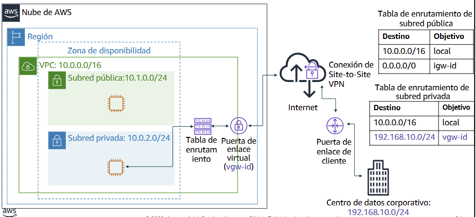

### **⚡ AWS Direct Connect**
- Conexión dedicada y privada entre tu red on-premise y AWS.
- Beneficios:
  - Menor latencia.
  - Mayor confiabilidad.
  - Mejor rendimiento que VPN tradicional.
  - Usa VLAN 802.1q para separar el tráfico.

    

### **🔌 Puntos de enlace de VPC**
- Conectan tu VPC con servicios de AWS sin salir a Internet:
1. Punto de enlace de interfaz (Interface Endpoint): usa PrivateLink, conecta servicios como S3, DynamoDB o servicios privados.
2. Punto de enlace de puerta de enlace (Gateway Endpoint): solo para S3 y DynamoDB.

    

### **🔁 AWS Transit Gateway**
- Permite conectar múltiples VPC y redes locales desde un solo punto.
- Es escalable y eficiente para entornos con muchas VPC.
- Ventajas:
  - Centraliza el enrutamiento.
  - Reduce la complejidad de interconexiones punto a punto.
  - Mejora el rendimiento en arquitecturas grandes.

    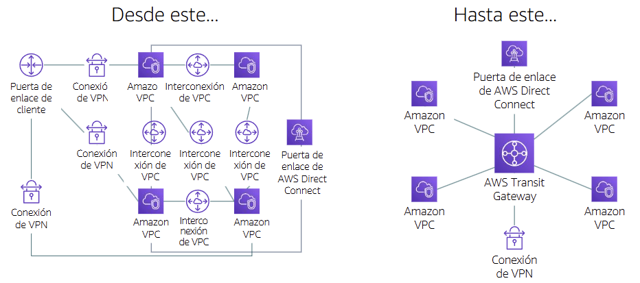

### **Actividad**

    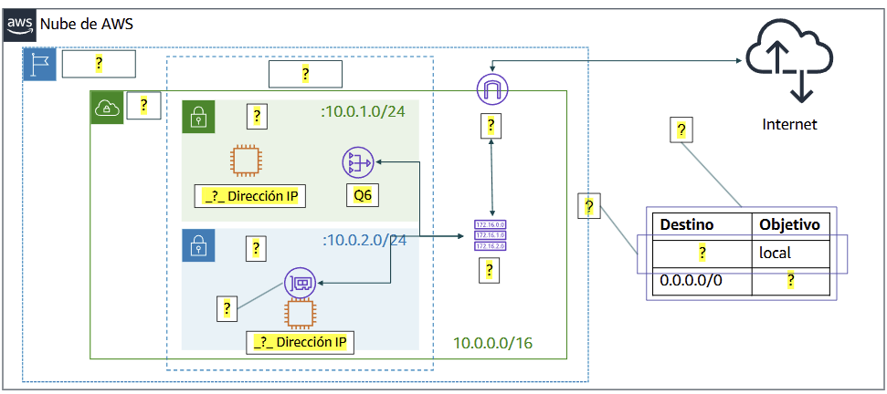

---

## Sección 4: **Seguridad de VPC**
### **🔐 Grupos de seguridad**
- Actúan como firewalls virtuales a nivel de instancia.
- Controlan el tráfico de entrada y salida mediante reglas de permiso (no de denegación).
- Las reglas son con estado (stateful): si se permite la entrada, la salida correspondiente también está permitida.
- Evaluación: se evalúan todas las reglas antes de tomar una decisión.

    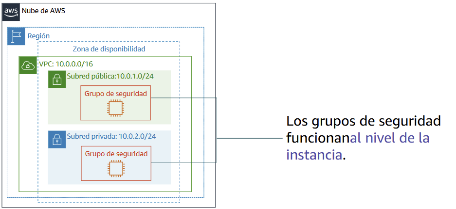
    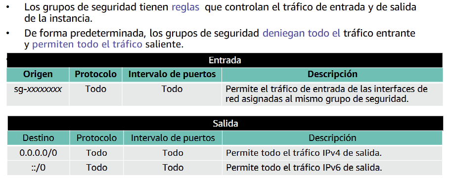

 

    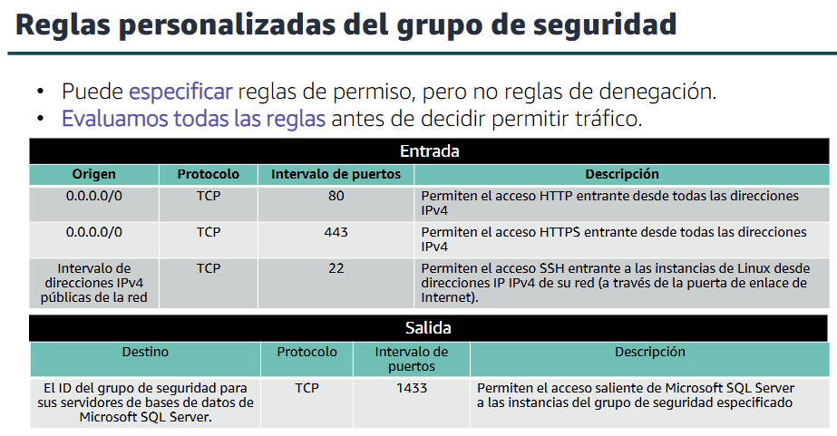

### **🧱 Listas de control de acceso a la red (ACLs)**
- Firewalls a nivel de subred.
- Permiten o deniegan tráfico con reglas independientes de entrada y salida.
- Las reglas son sin estado (stateless): el tráfico de respuesta también necesita regla explícita.
- Se aplican en orden numérico (menor número tiene mayor prioridad).

    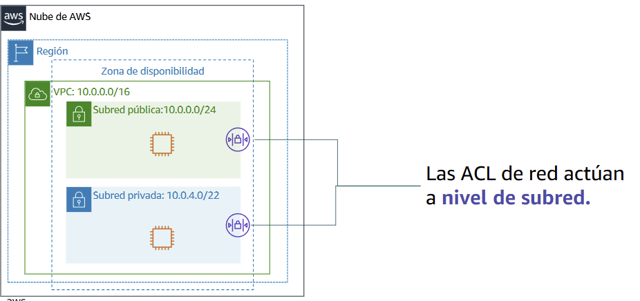
    

 

    

### **🔄 Comparación: SG vs ACL**
| Atributo       | Grupos de Seguridad     | ACL de red                |
| -------------- | ----------------------- | ------------------------- |
| Alcance        | Instancia               | Subred                    |
| Tipo de reglas | Solo permitir           | Permitir y denegar        |
| Estado         | Con estado (*stateful* es decir el tráfico de retorno se permite automáticamente, independientemente de las reglas)  | Sin estado (*stateless* es decir el tráfico de retorno debe estar explícitamente permitido por reglas)  |
| Evaluación     | Todas las reglas        | Orden numérico ascendente |

---

## Sección 5: **Route S3**
### **🌍 ¿Qué es Amazon Route 53?**
- Es el servicio DNS (sistema de nombres de dominio) de AWS.
- Redirige a los usuarios desde un nombre de dominio (como www.ejemplo.com) hacia una dirección IP pública (como 192.0.2.1).
- Funciona con IPv4 e IPv6.
- Se integra con servicios como EC2, S3 y ELB.
- Soporta:
  - Alta disponibilidad.
  - Verificación del estado (health checks).
  - Balanceo de carga global.

### **🧭 Resolución DNS con Route 53**
1. El usuario hace una solicitud DNS (por ejemplo, www.ejemplo.com).
2. El solucionador de DNS consulta a Route 53.
3. Route 53 devuelve la dirección IP del recurso.
4. El solucionador responde al usuario.

    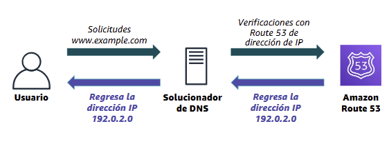

### **🔁 Tipos de enrutamiento admitido**
Route 53 admite múltiples políticas de enrutamiento para manejar el tráfico:
- Simple: un único servidor.
- Weighted (ponderado): distribuye tráfico según pesos asignados.
- Latencia: redirige al recurso con menor latencia.
- Geolocalización: según ubicación del usuario.
- Geoproximidad: según distancia del recurso.
- Conmutación por error: redirige a un backup si el principal falla.
- Con múltiples respuestas: devuelve varias IPs, el cliente elige una aleatoriamente.

### **🌐 Caso práctico: múltiples regiones**
- Route 53 puede usarse con ALB en distintas regiones.
- Ejemplo: el usuario es redirigido al balanceador más cercano.
- Beneficios:
  - Baja latencia.
  - Alta disponibilidad entre zonas y regiones.

    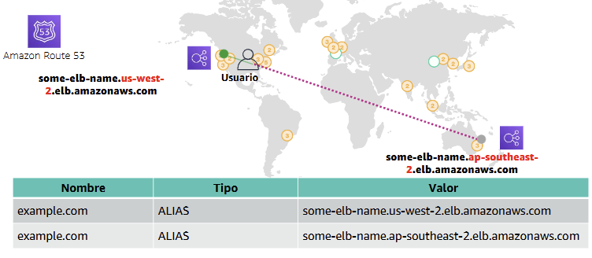

### **⚠️ Conmutación por error (failover)**
- Mejora la disponibilidad redirigiendo el tráfico ante fallos.
- Se configuran:
  - Checks de estado (health checks).
  - Escenarios de respaldo (failover policy).

### **🧩 Conmutación para apps de varios niveles**
- Route 53 puede gestionar una arquitectura de múltiples niveles:
  - Por ejemplo: redirigir al balanceador de carga o a un backend si el front-end falla.
- Se utilizan registros CNAME con política de failover para definir qué recurso es el principal y cuál es el de respaldo.

    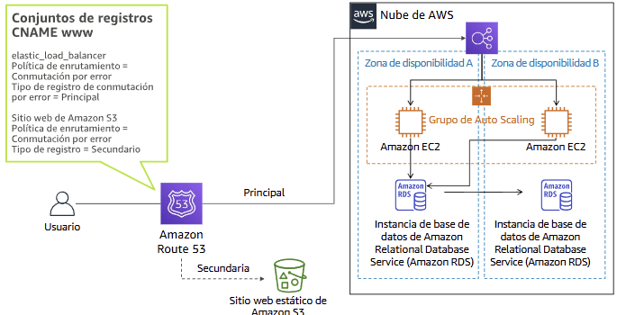

---

## Sección 6: **CloudFront**
### **📉 Entrega de contenido y latencia**
- La latencia ocurre por la distancia física y el número de saltos (enrutadores).
- Cuando un usuario accede a un sitio web (videos, imágenes, etc.), su solicitud puede pasar por muchas redes hasta el servidor de origen.
- Una red de distribución de contenido (CDN) mejora el rendimiento entregando los datos desde ubicaciones más cercanas.

    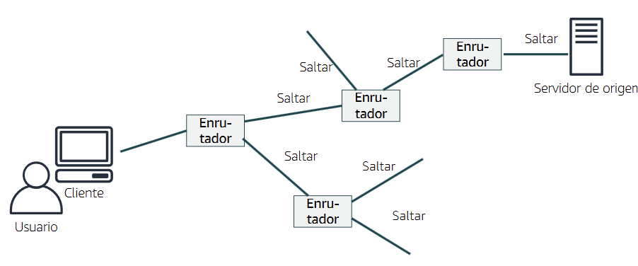

### **🌐 Red de entrega de contenido (CDN)**
- Es un sistema distribuido globalmente de servidores que:
  - Almacenan copias en caché de contenido solicitado frecuentemente (como HTML, CSS, JS, imágenes).
  - Aceleran la entrega de contenido estático y dinámico.
  - Mejoran el rendimiento, escalabilidad y experiencia del usuario.

### **⚡ ¿Qué es Amazon CloudFront?**
- Servicio de CDN rápido, seguro y global.
- Distribuye contenido desde ubicaciones perimetrales y cachés regionales.
- Beneficios clave:
  - Rapidez y alcance global
  - Seguridad en el borde (Edge): incluyendo HTTPS y certificados SSL.
  - Alta capacidad de programación: se integra con AWS Lambda@Edge.
  - Autoservicio y pago por uso

### **🌍 Infraestructura de CloudFront**
- Tiene:
  - Ubicaciones perimetrales (Edge Locations): sirven contenido al usuario.
  - Cachés regionales: actúan como intermedio entre el origen y los Edge.
- El contenido popular se almacena más cerca del usuario, reduciendo la latencia.

    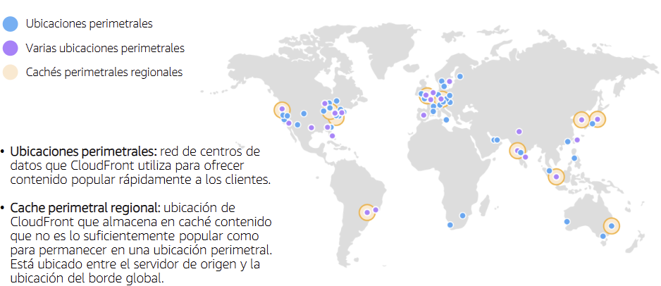

### **✅ Beneficios de CloudFront**
- Rendimiento mejorado, incluso para aplicaciones dinámicas.
- Seguridad con herramientas como AWS WAF, Shield, ACM.
- Integración con otros servicios de AWS.
- Económico: sin compromisos mínimos; solo pagas por lo que usas.

### **💰 Precios de CloudFront**
1. Transferencia de datos: por volumen desde ubicaciones de borde.
2. Solicitudes HTTPS: por número de solicitudes realizadas.
3. Invalidaciones: primeras 1.000 rutas son gratuitas; luego $0.005 por ruta.
4. Certificados SSL personalizados: $600/año por distribución (opcional).