# Módulo 6 - Informática
Texto

---

## 📌 Temas

- Información general sobre los servicios de informática
- Amazon EC2: 1ra parte
- Amazon EC2: 2da parte
- Amazon EC2: 3ra parte
- Optimización de costos con Amazon EC2
- Servicios de contenedores
- Introducción a AWS Lambda
- Introducción a AWS Elastic Beanstalk

---

## Sección 1: **Información general sobre los servicios de informática**
### **💻 ¿Qué son los servicios de cómputo de AWS?**
AWS ofrece diferentes servicios de cómputo que permiten ejecutar aplicaciones, almacenar datos y escalar recursos según necesidad. Algunos servicios destacados:
- Amazon EC2: Instancias de máquinas virtuales (IaaS).
- Auto Scaling: Escala instancias EC2 automáticamente según demanda.
- Amazon ECS/EKS: Ejecutan contenedores con Docker o Kubernetes.
- AWS Lambda: Ejecuta código sin administrar servidores (serverless).
- AWS Elastic Beanstalk: Implementación automática de apps web.
- AWS Fargate: Ejecuta contenedores sin aprovisionar servidores.

<p align="center">
    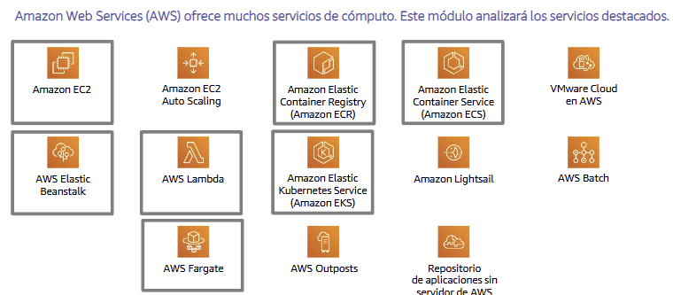
</p>

### **🗂️ Clasificación de servicios de cómputo**
| Categoría                            | Servicio(s)       | Características principales                            |
| ------------------------------------ | ----------------- | ------------------------------------------------------ |
| IaaS (Infraestructura como Servicio) | Amazon EC2        | Control total de VM, OS, red y almacenamiento          |
| Serverless                           | AWS Lambda        | No requiere administración, se paga solo por ejecución |
| Contenedores                         | ECS, EKS, Fargate | Escalables, ligeros, ideales para microservicios       |
| PaaS (Plataforma como Servicio)      | Elastic Beanstalk | Simplifica despliegue y escalado de apps               |

### **✅ ¿Cómo elegir el servicio óptimo?**
Depende del caso práctico. Debes considerar:
- ¿Cuál es el diseño de la app?
- ¿Cuáles son los patrones de uso?
- ¿Qué ajustes de configuración necesitas?

Usar un servicio inadecuado puede generar ineficiencia y sobrecostos.

Buenas prácticas:
- Evaluar métricas y opciones disponibles.
- Probar configuraciones distintas.
- Revisar requisitos de escalado y administración.

---

## Sección 2: **Amazon EC2**
### **💡 ¿Qué es Amazon EC2?**
Amazon Elastic Compute Cloud (EC2) proporciona máquinas virtuales en la nube para ejecutar aplicaciones, sin necesidad de comprar o mantener servidores físicos.

Ventajas:
- Escalable (elasticidad).
- Control total del sistema operativo.
- Disponible en múltiples regiones y zonas de disponibilidad.
- Pago por uso de las instancias.

**¿Para qué se usa EC2?**
- Servidores web.
- Bases de datos.
- Aplicaciones empresariales.
- Entornos de prueba/desarrollo.
- Servicios backend y de correo.

### **⚙️ Lanzamiento de una instancia EC2**
Se realiza desde la consola de AWS usando el Asistente de lanzamiento, donde se toman decisiones como:
- Selección de una AMI (Amazon Machine Image).
- Selección de un tipo de instancia.
- Configuración de red y almacenamiento.
- Establecer reglas de seguridad.
- Revisión y lanzamiento.

**🧱 1. Seleccionar una AMI**
Una AMI incluye:
- Sistema operativo (Linux, Windows).
- Aplicaciones, librerías o configuraciones preinstaladas.
- Opciones de almacenamiento.

Tipos de AMI:
- Quick Start: Prediseñadas por AWS.
- My AMIs: Personalizadas por el usuario.
- Marketplace: AMIs de terceros con software comercial.

🧪 Ejemplo: creación de una nueva AMI
Se puede:
- Importar una máquina virtual.
- Crear desde una instancia EC2 existente.
- Modificar y guardar una AMI.
- Compartir la AMI o copiarla a otras regiones.

**🧮 2. Seleccionar tipo de instancia**
Determina:
- CPU (vCPU).
- Memoria RAM.
- Tipo de almacenamiento.
- Rendimiento de red.

Las instancias se agrupan por:
- Familia (ej. t3, m5, c6g...).
- Generación (ej. t3, t4...).
- Tamaño (ej. small, medium, large...).

📊 Tabla de ejemplo
| Tipo       | vCPU | Memoria (GB) | Almacenamiento |
| ---------- | ---- | ------------ | -------------- |
| t3.micro   | 2    | 1            | Solo EBS       |
| t3.small   | 2    | 2            | Solo EBS       |
| t3.medium  | 2    | 4            | Solo EBS       |
| t3.large   | 2    | 8            | Solo EBS       |
| t3.xlarge  | 4    | 16           | Solo EBS       |
| t3.2xlarge | 8    | 32           | Solo EBS       |


🎯 Elección del tipo según el caso
| Categoría                       | Familias | Casos de uso                   |
| ------------------------------- | -------- | ------------------------------ |
| Propósito general               | t3, m5   | Uso amplio                     |
| Optimizadas para cómputo        | c4, c5   | Alto rendimiento de CPU        |
| Optimizadas para memoria        | r4, r5   | Bases de datos                 |
| Optimización con GPU            | p3, g4   | Machine learning / IA          |
| Optimizadas para almacenamiento | d2, i3   | Sistemas de archivos, big data |

🌐 Red y tipo de instancia

- El ancho de banda de red (Gbps) varía según el tipo de instancia.
- Algunas admiten redes mejoradas:
  - ENA (hasta 100 Gbps).
  - Intel 82599 (hasta 10 Gbps).
- Se recomienda agrupar instancias en grupos de ubicación (Placement Groups) para mejorar rendimiento.

**🌐 3. Especificar la configuración de red**
- Define en qué VPC y subred se lanza la instancia.
- Puedes decidir si deseas que se le asigne una dirección IP pública automática.
- También se puede seleccionar una zona de disponibilidad específica.

**🔐 4. Adjuntar un rol de IAM (opcional)**
- Permite que una instancia EC2 use permisos de IAM para acceder a otros servicios de AWS (como S3, DynamoDB, etc.).
- Se recomienda usar perfiles de instancia para mayor seguridad y control.

**🧾 5. Script de datos de usuario (opcional)**
- Automatiza tareas al lanzar una instancia (como instalar software o configurar el sistema).
- Se usa un script bash (Linux) o comandos PowerShell/batch (Windows).
- Ejemplo común: instalar actualizaciones con yum update o apt-get.

**💾 6. Especificar almacenamiento**
- Se configura el volumen raíz (donde va el SO) y volúmenes adicionales.
- Parámetros:
  - Tamaño (en GB).
  - Tipo de disco (SSD/HDD).
  - Si se elimina al terminar la instancia.
  - Si se usa cifrado.

📦 Tipos de almacenamiento en EC2
| Tipo                   | Descripción                                                   |
| ---------------------- | ------------------------------------------------------------- |
| **Amazon EBS**         | Bloques persistentes, buena durabilidad y rendimiento.        |
| **EC2 Instance Store** | Almacenamiento temporal, ligado al hardware físico.           |
| **Amazon EFS**         | Sistema de archivos compartido, ideal para varias instancias. |

**🏷️ 7. Agregar etiquetas (Tags)**
- Forma de organizar recursos con pares clave-valor.
- Facilita la búsqueda, automatización y control de costos.
- Ejemplo: Key: Name → Value: WebServer.

**🔐 8. Configuración del grupo de seguridad**
- Firewall virtual para controlar tráfico de entrada y salida.
- Se definen reglas:
  - Protocolo (TCP, UDP, ICMP).
  - Rango de puertos.
  - IP origen o destino.
- Las reglas son stateful (si entra, puede salir por defecto).

**🔑 9. Par de claves (key pair)**
- Se usa para conectarse a la instancia:
  - Linux: por SSH usando la clave privada.
  - Windows: descifrar la contraseña de RDP con la clave privada.
- Se puede crear o seleccionar al momento de lanzar la instancia.

### **🖥️ Consola EC2**
- Luego de lanzar una instancia, puedes verla en la consola de EC2 bajo View Instances.
- Se puede consultar:
  - IP pública y privada.
  - AMI utilizada.
  - Tipo de instancia.
  - VPC/subred.
  - Seguridad, volúmenes, y más.
- Todo se encuentra en la pestaña Description.

<p align="center">
    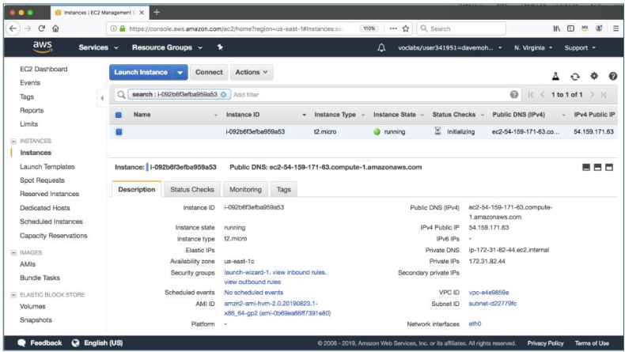
</p>

### **💻 AWS CLI: lanzar una instancia EC2 por línea de comandos**
Ejemplo básico:
```bash
aws ec2 run-instances \
--image-id ami-123abc4d \
--count 1 \
--instance-type c3.large \
--key-name MyKeyPair \
--security-groups MySecurityGroup \
--region us-east-1
```

### **🔁 Ciclo de vida de una instancia EC2**

<p align="center">
    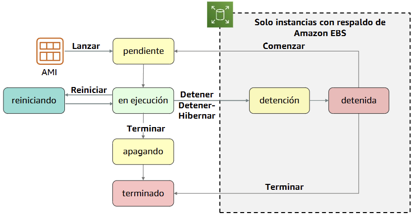
</p>

Estados posibles:
- pending (pendiente)
- running (en ejecución)
- stopping / stopped (detenida)
- shutting-down / terminated (terminada)
- rebooting (reinicio)
- hibernated (si aplica)

📌 Solo instancias con volumen EBS pueden detenerse y reiniciarse; las de Instance Store se eliminan.

### **🌍 Dirección IP elástica (Elastic IP)**
- IP pública persistente que no cambia al reiniciar la instancia.
- Beneficios:
  - Mantiene la IP y el DNS asociado.
  - Se puede asociar a otra instancia si la original falla.
- AWS permite hasta 5 Elastic IPs por región por defecto.

### **🔐 Metadatos de la instancia**
- Información útil sobre la instancia en ejecución (disponible desde dentro de ella).
- Se accede vía navegador o comando:

```bash
curl http://169.254.169.254/latest/meta-data/
```

- Ejemplos: IPs, hostname, ID de instancia, AMI, grupo de seguridad.

### **📊 Supervisión con Amazon CloudWatch**
- Amazon EC2 se integra con CloudWatch para monitorear en tiempo real:
  - Uso de CPU, disco, red.
  - Alarmas y métricas personalizadas.

- Hay dos niveles:
  - Básico: datos cada 5 minutos.
  - Detallado: datos cada 1 minuto (requiere activación y posible costo).

<p align="center">
    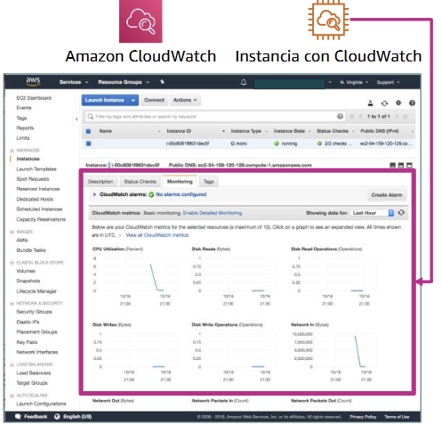
</p>

---

## Sección 3: **Optimización de costos con Amazon EC2**
### **💲 Modelos de precios de EC2**
| Tipo de Instancia | Características                                                                 |
| ----------------- | ------------------------------------------------------------------------------- |
| **Bajo demanda**  | Pago por hora/segundo. Alta flexibilidad. Ideal para cargas de prueba o picos.  |
| **Reservadas**    | Pago anticipado por 1 o 3 años. Ahorro de hasta el 75%.                         |
| **Spot**          | Hasta 90% de descuento. Interrumpibles. Buenas para cargas tolerantes a fallos. |
| **Dedicadas**     | Servidores físicos exclusivos. Útiles para requisitos de cumplimiento.          |

### **🎯 Casos de uso**
| Modelo       | Casos ideales                                                      |
| ------------ | ------------------------------------------------------------------ |
| Bajo demanda | Desarrollo, pruebas, cargas esporádicas.                           |
| Spot         | Modelos de machine learning, Big Data, tareas paralelas.           |
| Reservadas   | Aplicaciones de uso estable (bases de datos, ERP, servidores web). |
| Dedicadas    | Cumplimiento regulatorio, licencias por socket o núcleo.           |

### **🧱 Cuatro pilares para optimizar costos**

<p align="center">
    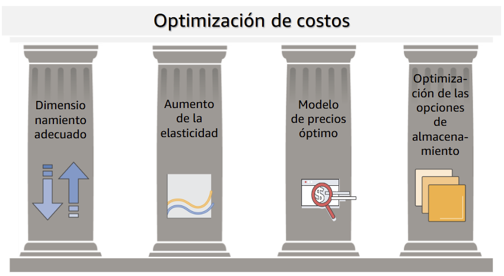
</p>

**🧊 Pilar 1: Dimensionamiento adecuado**
- Elegir el tipo y tamaño de instancia apropiado.
- Medir el rendimiento con Amazon CloudWatch.
- Ajustar según necesidad real.
- Recomendación: primero tamaño correcto, luego reservar.

**📈 Pilar 2: Aumento de la elasticidad**
- Iniciar/parar instancias cuando no se usen (ej: fuera del horario laboral).
- Hibernar instancias respaldadas por EBS.
- Usar escalado automático para adaptarse a la demanda en tiempo real.

**💸 Pilar 3: Modelo de precios óptimo**
- Elegir el modelo que mejor se ajuste al caso práctico.
- Combinar tipos de compra: bajo demanda + spot + reservadas.
- Considerar soluciones serverless como AWS Lambda para reducir costos.

**💾 Pilar 4: Optimización del almacenamiento**
- Ajustar tamaño y tipo de volúmenes EBS.
- Elegir almacenamiento menos costoso (gp2 vs st1, por ejemplo).
- Eliminar volúmenes no utilizados o instancias innecesarias.
- Identificar almacenamiento adecuado para cada tipo de datos.

### **🔍 Medición, supervisión y mejora**
- La optimización de costos es un proceso continuo.
- Recomendaciones:
  - Aplicar etiquetado de costos (tags).
  - Definir y revisar métricas periódicamente.
  - Promover diseño orientado a costos en los equipos.
  - Usar herramientas como AWS Trusted Advisor.

---

## Sección 4: **Servicios de contenedores**
### **✅ Conceptos básicos de contenedores**
- Los contenedores son un método de virtualización del sistema operativo que permite ejecutar aplicaciones en entornos aislados de forma repetible.
- Beneficios:
  - Repetibles y portátiles.
  - Entornos autónomos.
  - El software se ejecuta igual en todos los entornos (producción, desarrollo, prueba).
  - Más rápidos para iniciar/detener que las máquinas virtuales.
  - Empaquetan el código, configuraciones y dependencias.

### **🐳 ¿Qué es Docker?**
- Plataforma de software que permite crear, probar e implementar aplicaciones rápidamente dentro de contenedores.
- Los contenedores en Docker se basan en imágenes (plantillas).
- Un contenedor incluye todo lo necesario para ejecutar la aplicación (código, sistema, librerías, etc.).

### **🆚 Máquinas virtuales vs. contenedores**
- Máquinas virtuales (VM): Ejecutan su propio sistema operativo invitado sobre un hipervisor.
- Contenedores: Ejecutan sobre el mismo sistema operativo y comparten su kernel, por lo que son más ligeros y rápidos.
- En AWS se pueden usar ambas tecnologías, pero los contenedores son más eficientes para ciertos escenarios como microservicios o tareas repetitivas.

### **🛠️ Amazon Elastic Container Service (Amazon ECS)**
- Servicio de administración de contenedores en AWS.
- Beneficios:
  - Coordinación y escalado de clústeres.
  - Simplificación del proceso de implementación.
  - Alta eficiencia.

- Integración nativa con:
  - Balanceadores de carga.
  - Grupos de seguridad.
  - Amazon EC2.
  - IAM (permisos).

### **📦 Organización de contenedores en ECS**
- Se definen tareas, que agrupan contenedores que comparten configuración y recursos.
- Las tareas se colocan dentro de clústeres.
- AWS ECS gestiona dónde y cómo se ejecutan esas tareas, ya sea en instancias EC2 o con tecnología Fargate.

### **🧩 Opciones de clúster en ECS**
- Dos opciones principales:
  1. Clúster respaldado por Amazon EC2 (usted administra la infraestructura).
  2. Clúster respaldado por AWS Fargate (sin administración de servidores).

- ECS con Fargate elimina la necesidad de elegir tipos de instancia o escalar manualmente.

<p align="center">
    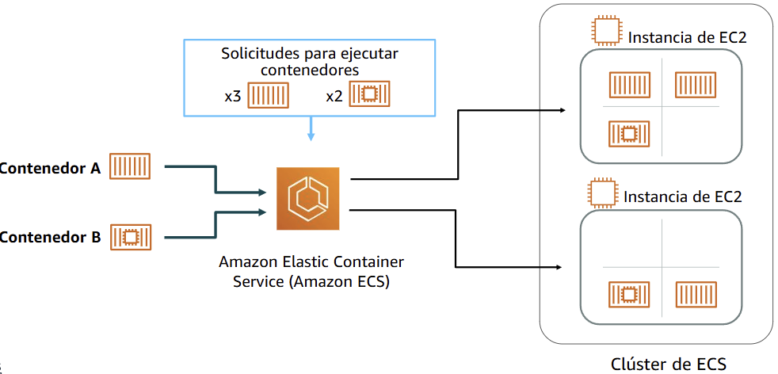
</p>

### **☸️ ¿Qué es Kubernetes?**
- Software de código abierto para coordinar contenedores.
- Automatiza:
  - Aprovisionamiento.
  - Red.
  - Escalado.
  - Balanceo de carga.

- Complementa a Docker y coordina múltiples nodos que ejecutan contenedores.

### **☁️ Amazon Elastic Kubernetes Service (Amazon EKS)**
- Servicio administrado por AWS para ejecutar Kubernetes sin tener que instalarlo ni administrarlo directamente.
- Permite:
  - Gestionar clústeres de EC2 que ejecutan Kubernetes.
  - Ejecutar cargas de trabajo en contenedores coordinadas por Kubernetes.

- Compatible con herramientas de la comunidad de Kubernetes.

### **🗃️ Amazon Elastic Container Registry (Amazon ECR)**
- Registro administrado de imágenes de contenedores Docker.
- Beneficios:
  - Integración con Amazon ECS y EKS.
  - Compatible con herramientas de Docker.
  - Soporte para control de acceso, cifrado en reposo y uso vía HTTPS.

---

## Sección 5: **Introducción a AWS Lambda**
### **🔹 ¿Qué es AWS Lambda?**
- Es un servicio de cómputo sin servidor (serverless).
- Permite ejecutar código en respuesta a eventos sin necesidad de aprovisionar ni administrar servidores.
- Solo se paga por el tiempo de cómputo que se consume (no hay cargos mientras el código no se ejecuta).
- El código se ejecuta dentro de una función Lambda, que responde a eventos como cargas en S3, cambios en DynamoDB o eventos programados.

<p align="center">
    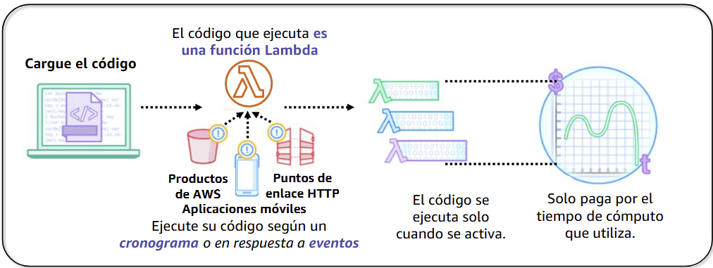
</p>

### **🔹 Beneficios de AWS Lambda**
- Compatible con múltiples lenguajes (Java, Go, Node.js, Python, C#, Ruby, PowerShell).
- Administración automatizada completamente.
- Tolerancia a fallos integrada.
- Escalabilidad automática y ejecución distribuida.
- Pago por uso — sin costos de aprovisionamiento o tiempo inactivo.
- Permite coordinar múltiples funciones con AWS Step Functions.

### **🔹 Fuente de eventos de AWS Lambda**
- AWS Lambda puede activarse desde servicios como:
  - S3 (ej. carga de objetos),
  - DynamoDB (modificación de datos),
  - SNS, SQS, CloudWatch Events, API Gateway, entre otros.

- Puede ser invocada de forma directa (sincrónica) o indirecta (asincrónica).

<p align="center">
    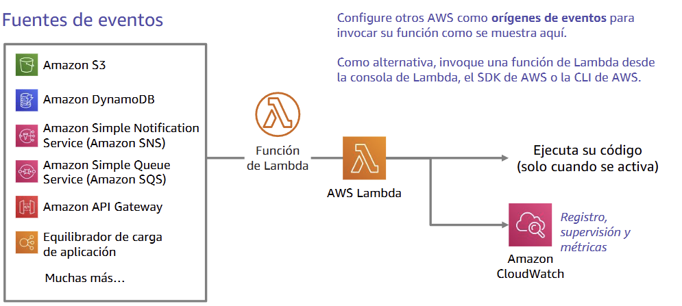
</p>

### **🔹 Configuración de una función Lambda**
- Para crear una función, se define:
  - El entorno de ejecución (ej. Node.js, Python),
  - El código fuente y dependencias,
  - El rol de ejecución (permite a Lambda acceder a otros servicios),
  - El evento desencadenador (trigger),
  - Las variables de entorno, etiquetas, memoria y tiempo de ejecución.

<p align="center">
    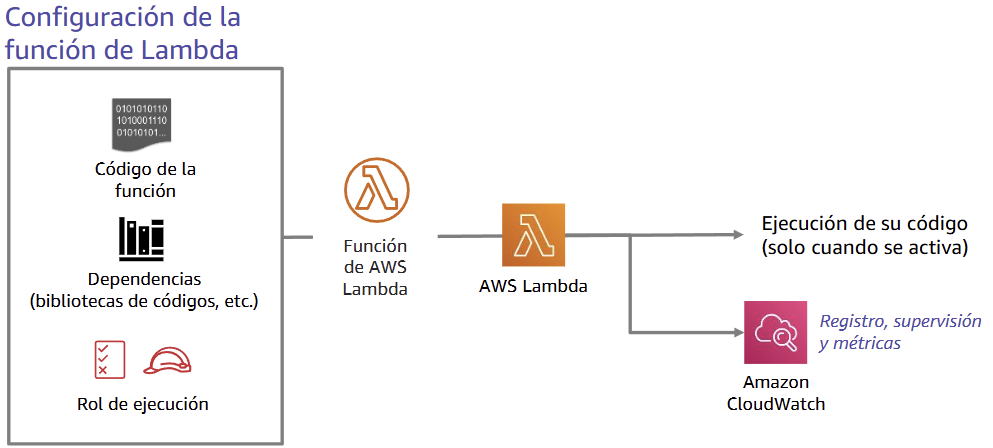
</p>

### **🛠️ Ejemplo 1: Detener e iniciar instancias EC2**
- Usando Lambda + CloudWatch:
  - Se programa una función para detener EC2 a las 22:00,
  - Y otra para iniciarlas a las 05:00.
  - Ambas usan eventos de tiempo como activadores y roles de IAM adecuados.

<p align="center">
    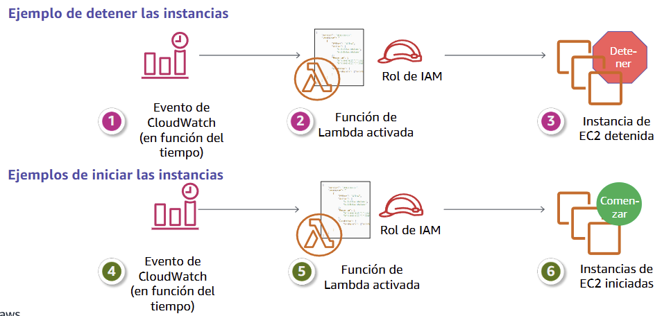
</p>


### **🖼️ Ejemplo 2: Crear imágenes en miniatura**
- Cuando un archivo .jpg/.png se carga en S3:
  - Lambda se activa, obtiene el objeto,
  - Crea una miniatura (thumbnail),
  - Y la guarda en otro bucket objetivo.

<p align="center">
    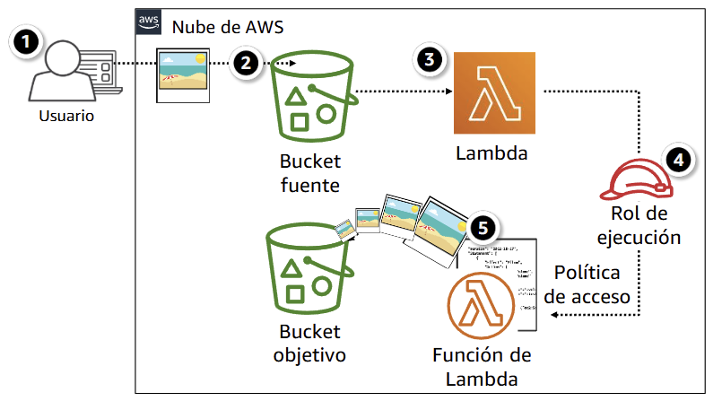
</p>

### **🔹 Cuotas de AWS Lambda**
- Por región:
  - 1,000 ejecuciones simultáneas,
  - 75 GB de almacenamiento para funciones y capas.

- Por función:
  - Máx. 10,240 MB de memoria asignada,
  - Máx. 15 minutos de ejecución,
  - Máx. 250 MB por paquete de implementación,
  - Máx. 10 GB para código e imágenes en contenedor.

---

## Sección 6: **Introducción a AWS Elastic Beanstalk**
### **✅ ¿Qué es AWS Elastic Beanstalk?**
- Es una plataforma como servicio (PaaS) que permite implementar y gestionar fácilmente aplicaciones web.
- Automatiza:
  - Aprovisionamiento y configuración
  - Implementación
  - Equilibrado de carga
  - Escalado automático
  - Monitoreo del estado
  - Análisis y depuración
- Solo se paga por los recursos subyacentes (EC2, S3, etc.). No tiene costos adicionales.

### **⚙️ Implementación de AWS Elastic Beanstalk**
- Admite aplicaciones web escritas para plataformas comunes:
  - Java, .NET, PHP, Node.js, Python, Ruby, Go, Docker
- Elastic Beanstalk gestiona automáticamente:
  - El entorno de ejecución
  - El escalado
  - El balanceo de carga
- Se ejecuta en servidores como:
  - Apache, NGINX, Passenger, Puma, IIS

<p align="center">
    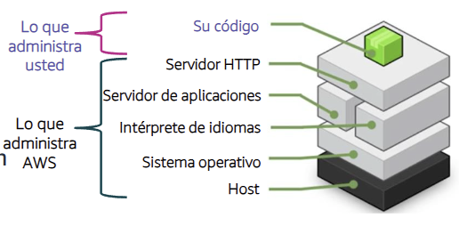
</p>

### **🌟 Beneficios de Elastic Beanstalk**

| Beneficio                          | Descripción                                                                 |
| ---------------------------------- | --------------------------------------------------------------------------- |
| Rápido y sencillo de empezar       | Se puede iniciar con solo subir el código a la consola o IDE compatibles    |
| Productividad para desarrolladores | Permite enfocarse en el desarrollo del código sin gestionar infraestructura |
| Difícil de superar                 | Maneja múltiples cargas de trabajo y escala automáticamente                 |
| Control completo de recursos       | Se puede elegir el tipo de instancia, bases de datos, escalado, etc.        |

- Aunque automatiza muchas tareas, el usuario mantiene el control total sobre los recursos de AWS utilizados.
- Elastic Beanstalk es ideal para quienes desean una implementación sencilla sin renunciar a la flexibilidad.